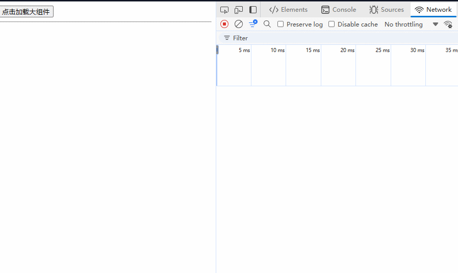
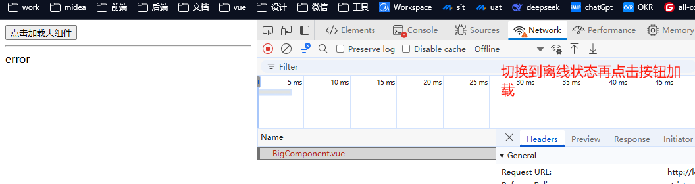

# 异步组件

假如我们加载某个很大的组件（不一定是这个组件代码多，可能这个组件依赖了某个很大的 js 库）

例如下面的 `BigComponent.vue` 依赖了 `lodash` 这个无法tree-shaking的库，就需要将这个组件作为一个异步组件

```vue
<script setup lang="ts">
import _ from 'lodash';

console.log("_--->", _.chunk([1, 2, 3, 4], 2));
</script>

<template>
  <div class="box">这是一个大组件</div>
</template>
```

那么我们在加载的时候，就需要等待正在需要展示的时候（比如进入可视区，点击了按钮才展示）之后才去加载。

在 vite 中，通过 `import()` 函数去加载异步组件：

```vue
<script setup lang="ts">
import { shallowRef, type Component } from 'vue';
import { RouterLink, RouterView } from 'vue-router'

const asyncComp = shallowRef<Component | null>(null);
async function handleClick () {
  const BigComponent = await import('./components/BigComponent.vue');
  asyncComp.value = BigComponent.default;
}
</script>

<template>
  <button @click="handleClick">点击加载大组件</button>
  <hr>
  <component :is="asyncComp"></component>
</template>
```



这样，只有当用户点击了按钮之后，我们才触发加载组件的动作

异步组件还需要考虑，加载过程中怎么给用户提示，加载失败怎么提示用户。这些，vue3已经为我们考虑好了，提供了 `defineAsyncComponent()` 这个定义异步组件的API，它有几个主要选项：

- `loader`：加载函数，用于加载指定的**目标组件**
- `loadingComponent`：加载过程中的**替身组件**
- `errorComponent`：加载失败的**替罪羊组件**
- `delay`：设定替身组件出现的延迟时间。如果加载时间够快，替身可以不用出场。默认值是 200ms。
- `timeout`：设定超时时间，超过这个时间就算加载失败。默认值是 Infinity，即永不超时。

如果我们不需要那么中间态的切换，只想要简单的考虑异步加载，可以用下面的简写：

```typescript
const asyncComp = shallowRef<Component | null>(null);
async function handleClick () {
  asyncComp.value = defineAsyncComponent(() => import('./components/BigComponent.vue'));
}
```

如果需要考虑中间状态，就需要新建几个 `my-loading.vue` 的组件如下：

```vue
<template>
  <div>
    loading
  </div>
</template>
```

 `my-error.vue` 的组件如下：

```vue
<template>
  <div>
    error
  </div>
</template>
```

然后用对象的方式传递给 `defineAsyncComponent()`

```typescript
import MyLoading from '@/components/my-loading.vue';
import MyError from '@/components/my-error.vue';

const asyncComp = shallowRef<Component | null>(null);
async function handleClick () {
  asyncComp.value = defineAsyncComponent({
    loader: () => import('./components/BigComponent.vue'),
    loadingComponent: MyLoading,
    errorComponent: MyError
  });
}
```

比如离线状态下再点击按钮，此时加载js失败，就会展示 `my-error.vue` 组件的内容



