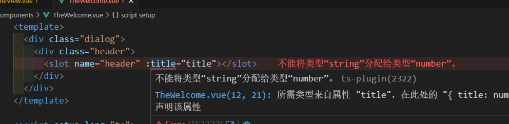

# vue新功能

## 1、vue3.5新增

### 新增API：userTemplateRef

新增 `useTemplateRef` 这个api

在以往的开发中，我们通过ref获取DOM或者组件，是下面的写法

```vue
<template>
  <div ref="xiaoming">
    sdfsdf
  </div>
</template>

<script setup lang="ts">
const xiaoming = ref();
onMounted(() => {
  console.log('获取DOM', xiaoming.value);
})
</script>
```

现在为了和普通ref更好的区分，`vue3.5` 新增  `useTemplateRef`  这个api

```vue
<template>
  <div ref="xiaoming">
    sdfsdf
  </div>
</template>

<script setup lang="ts">
const ddd = useTemplateRef('xiaoming');
onMounted(() => {
  console.log('获取DOM', ddd.value);
})
</script>
```


## 2、vue3.3新增

### 新增泛型组件

在ts中，有泛型的概念，vue3.3之后，也添加了泛型组件的概念，是的我们在组件中可以更好的使用泛型

比如组件 `TheWelcome.vue` 代码如下:

```vue
<template>
  <ul>
    <li v-for="(item, $idx) of list" :key="$idx">{{ item }}</li>
  </ul>
</template>

<script setup lang="ts" generic="T">
withDefaults(defineProps<{
  list: T[]
}>(), {})
</script>
```

这样就很好的标识出了`list`只要求是一个数组，至于数组的内容是什么，就根据传递进来的决定

比如父组件这么使用

```vue
<template>
  <TheWelcome :list="result"/>
</template>

<script setup lang="ts">
import { ref } from 'vue';
import TheWelcome from '../components/TheWelcome.vue';
const result = ref([
  { cname: '张三' },
  { cname: '李四' },
  { cname: '王五' },
]);
</script>
```

如果有必要，我们也可以为其添加泛型约束，写法如下：

```vue
<script setup lang="ts" generic="T extends {cname:string}">
withDefaults(defineProps<{
  list: T[]
}>(), {})
</script>
```

这样就要求父组件传递过来的list数组，每一项都必须有 `{cname: string}` 属性


如果要把props类型抽成一个单独的文件，可以按照下面这么写：

`props.ts` 代码如下：

```ts
export interface PropsType<T> {
  list: T[]
}
```

`TheWelcome.vue` 代码如下：

```vue
<script setup lang="ts" generic="T extends {cname:string}">
import { type PropsType } from './props';

withDefaults(defineProps<PropsType<T>>(), {})
</script>
```


###  新增api：defineSlots

我们使用插槽，有时候需要给父组件传递数据，比如下面

```vue
<template>
  <div class="dialog">
    <div class="header">
      <slot name="header" :title="title"></slot>
    </div>
  </div>
</template>

<script setup lang="ts">
import { ref } from 'vue';
const title = ref('xiaoming');
</script>
```

我们想要约束下  `<slot name="header" :title="title"></slot>` 中的参数类型，就可以使用 `defineSlots` 了

```vue
<template>
  <div class="dialog">
    <div class="header">
      <slot name="header" :title="title"></slot>
    </div>
  </div>
</template>

<script setup lang="ts">
import { ref } from 'vue';
defineSlots<{
  header: (props: { title: number }) => any;
}>()
const title = ref('xiaoming');
</script>
```

可以看到代码已经提示




