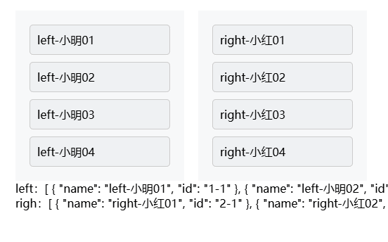

# vue-draggable-plus拖拽库

支持 Vue>=v3 或 Vue >=2.7，基于 `Sortablejs`，[组件文档](https://vue-draggable-plus.pages.dev/guide/)


## 简单的demo

**组件方式使用：**

```vue
<template>
  <VueDraggable class="list" v-model="list">
    <div v-for="item in list" :key="item.id" class="item">
      {{ item.name }}
    </div>
  </VueDraggable>

  <div>{{ list }}</div>
</template>

<script setup lang="ts">
import { ref } from "vue";
import { VueDraggable } from "vue-draggable-plus";

const list = ref([
  { name: "Joao", id: 1 },
  { name: "Jean", id: 2 },
  { name: "Johanna", id: 3 },
  { name: "Juan", id: 4 },
]);
</script>

<style>
.list {
  width: 500px;
  display: flex;
  flex-direction: column;
  gap: 10px;
}

.item {
  padding: 10px;
  border: 1px solid #ccc;
  border-radius: 5px;
  background-color: #f9f9f9;
  cursor: grab;
}
</style>
```

运行效果如下：


查看HTML结构，可以看到组件 `<VueDraggable>` 其实渲染出来就是一个 `<div>`


**hooks方式调用：**

支持使用hooks的方式调用，只需要将获取到的父级DOM传过去就可以

```vue
<template>
  <div ref="listRef" class="list" >
    <div v-for="item in list" :key="item.id" class="item">
      {{ item.name }}
    </div>
  </div>

  <div>{{ list }}</div>
</template>

<script setup lang="ts">
import { useTemplateRef } from "vue";
import { ref } from "vue";
import { useDraggable } from "vue-draggable-plus";

const list = ref([
  { name: "Joao", id: 1 },
  { name: "Jean", id: 2 },
  { name: "Johanna", id: 3 },
  { name: "Juan", id: 4 },
]);

const listRef = useTemplateRef('listRef');
// 返回值是一个对象，包含了一些方法，比如 start、destroy、pause 等
const draggable = useDraggable(listRef, list, {
  animation: 150,
  onStart() {
    console.log('start')
  }
});
</script>
```

**指令方式调用：**

```vue
<template>
  <div v-draggable="[list, options]" class="list">
    <div v-for="item in list" :key="item.id" class="item">
      {{ item.name }}
    </div>
  </div>

  <div>{{ list }}</div>
</template>

<script setup lang="ts">
import { useTemplateRef } from "vue";
import { ref } from "vue";
import { vDraggable, type UseDraggableOptions } from "vue-draggable-plus";

const list = ref([
  { name: "Joao", id: 1 },
  { name: "Jean", id: 2 },
  { name: "Johanna", id: 3 },
  { name: "Juan", id: 4 },
]);

const options: UseDraggableOptions<any> = {
  animation: 150,
  onStart() {
    console.log("start");
  },
};
</script>
```

## 双向列表

双向列表拖拽也是常用的场景之一，实现很简单，例子可见[【双向列表demo】](https://vue-draggable-plus.pages.dev/demo/clone/)

实现方式是用2个 `<VueDraggable />`，然后给设置相同的 `group="xxx"` 属性。


在多列表操作中，有时候需要克隆模式，例子可见[【克隆demo】](https://vue-draggable-plus.pages.dev/demo/clone/)

克隆的实现上是靠配置 `:group="{ name:'people', pull: 'clone' }"` 比如我们给左边配置，右边不配置

```vue
<template>
  <div class="box">
    <VueDraggable class="left" :group="{ name:'people', pull: 'clone' }" >
      ...
    </VueDraggable>
      <VueDraggable class="right" :group="{ name:'people' }">
        ...
    </VueDraggable>
  </div>
</template>
```

效果如下，左边拖到右边的时候是克隆模式，右边拖到左边就还不是：


如果我们不想右边拖到左边，只能从左拖到右，可以改下配置 `put=false`，代码如下：

```vue
<template>
  <div class="box">
    <VueDraggable class="left" :group="{ name:'people', pull: 'clone', put: false }" >
      ...
    </VueDraggable>
      <VueDraggable class="right" :group="{ name:'people' }">
        ...
    </VueDraggable>
  </div>
</template>
```

效果如下：



克隆的时候，内部会自动使用 `JSON.parse(JSON.stringify())` 去克隆一份数据出来，我们也可以传递一个 `:clone="cloneFn"` 

```vue
<template>
	<VueDraggable :clone="clone">
    ...
  </VueDraggable>
</template>
<script setup lang='ts'>
interface Item {
  name: string;
  id: string;
}

function clone (el: Item) {
  return {
    name: el.name + '--clone',
    id: uuid(), // 
  }
}
</script>
```

如果我们想要让左边只能拖到右侧，左侧内部不能拖动，只需要加上 `:sort="false"` 即可

```vue
<template>
	<VueDraggable :group="{ name:'people', pull: 'clone', put: false }" :sort="false">
    ...
  </VueDraggable>
</template>
```

效果如下，左侧内部不能相互拖动：


## 配置

* `ghostClass`：设置拖动时候经过的那些DOM的样式

```vue
<template>
	<VueDraggable ghostClass="ghost" v-model="list" :animation="150">
  </VueDraggable>
</template>
<style>
.ghost {
  opacity: 0.5;
  background: red;
}
</style>
```

效果如下，在目标虚拟位置，谁就会加上 `className="ghost"` 这个样式。


* `handle`：指定能触发拖拽的句柄

```vue
<VueDraggable handle=".handle" >
    <div v-for="item in list" :key="item.id" class="item">
      <move-icon class="handle"></move-icon>
      {{ item.name }}
    </div>
</VueDraggable>
```

上面代码，指定了只有图标才可以触发拖拽，其他地方不触发不了


支持css选择器，比如可以通过 `handle=".handle svg"` 这种方式去选择更加细致的DOM出来作为句柄

* `target`：指定拖拽的容器，看下面和 element-plus 结合的例子
* `disabled`：禁用拖拽效果

## 和第3方组件库结合

#### elTable的行拖拽：

以 element-plus 的 `<el-table />` 为例，我们想要让行之间拖拽，因为 `<el-table />` 我们无法直接操作里面的属性和方法

所以这里我们需要通过 `target="xx"` 属性去控制，让拖拽的容器到指定的位置

比如有下面代码：

```vue
<template>
  <el-table :data="tableData" style="width: 100%">
    <el-table-column prop="name" label="姓名" width="180" />
    <el-table-column prop="date" label="日期" width="180" />
    <el-table-column prop="address" label="地址" />
  </el-table>
</template>

<script lang="ts" setup>
const tableData = ref([
  { name: 'Tom_01', date: '2016-05-03'  },
  { name: 'Tom_02', date: '2016-05-02'  },
  { name: 'Tom_03', date: '2016-05-04' },
  { name: 'Tom_04', date: '2016-05-01' },
])
</script>
```

首先我们需要通过F12找出每个行的直接父级


从图中可以看出，行数据的父级DOM是 `<tbody>` 所以我们需要将 `target` 设置为这个父级DOM，因此改动代码，加上` target=".el-table__body tbody"`：

```vue
<template>
	<VueDraggable target=".el-table__body tbody" v-model="tableData" :animation="150">
      <el-table :data="tableData" style="width: 100%">
        <el-table-column prop="name" label="姓名" width="180" />
        <el-table-column prop="date" label="日期" width="180" />
      </el-table>
  </VueDraggable>
</template>
```


#### elTable的列拖拽

如果 `<el-table />` 要实现列的拖拽，我们不能像以往一样将 `<el-table-column />` 的顺序写死

```vue
<template>
  <el-table :data="tableData" style="width: 100%">
    <!-- el-table-column要做成v-for渲染的 -->
    <el-table-column prop="name" label="姓名" width="180" />
    <el-table-column prop="date" label="日期" width="180" />
  </el-table>
</template>
```

最后代码如下，`<el-table-column />` 改为 v-for 渲染，然后 `<VueDraggable v-model="xxx" />` 绑定的也需要是列数据 `tableHeader` 而不是 `tableData`：

```vue
<template>
  <VueDraggable
    target=".el-table__header tr"
    v-model="tableHeader"
    :animation="150">
    <el-table :data="tableData">
      <el-table-column
        v-for="item of tableHeader"
        :key="item.prop"
        :prop="item.prop"
        :label="item.name"
        width="180"/>
    </el-table>
  </VueDraggable>
</template>

<script lang="ts" setup>
import { VueDraggable } from "vue-draggable-plus";
import { ref } from "vue";

const tableData = ref([
  { name: "Tom_01", date: "2016-05-03" },
  { name: "Tom_02", date: "2016-05-02" },
  { name: "Tom_03", date: "2016-05-04" },
  { name: "Tom_04", date: "2016-05-01" },
]);

const tableHeader = ref([
  { name: "姓名", prop: "name" },
  { name: "日期", prop: "date" },
]);
</script>
```

最终效果如下：


## 方法

* `start()` 和 `pause()`：控制拖拽功能启动或停止

```ts
import { type UseDraggableReturn } from "vue-draggable-plus";

const draggableRef = useTemplateRef<UseDraggableReturn>('draggableRef');
function start () {
  draggableRef.value?.start();
}
function pause () {
  draggableRef.value?.pause();
}
```

也可以通过配置 `disabled` 来达到效果

```vue
<VueDraggable :disabled="disabled">
 //...
</VueDraggable>
```

启动和停止之后，在 html 上不会有什么class变化

如果同时`disabled = true` 和 `start()` 那么 `disabled` 的优先级比较高。

## 生命周期函数

* `update`：当拖拽之后位置有发生变化才会触发，如果拖拽后返回了原来的位置这个时候数据没有更新，`update()` 也不会触发
* `start()`：当拖拽开始的时候触发一次
* `clone()`：当拖拽开始，会将选中的那个数据clone一份出来，这个时候触发 `clone()`

```vue
<template>
	<VueDraggable
    @update="onUpdate"
    @add="onAdd"
    @remove="remove">
  </VueDraggable>
</template>
```

