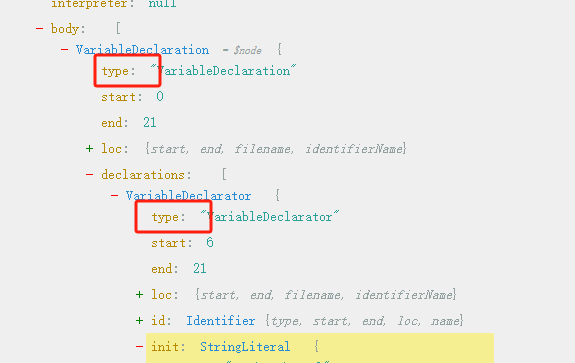

# AST语法树

现在ast生成效果：[astexplorer](https://astexplorer.net/)

凡是看到ast中的type的可以认为是一个ast节点



`@babel/core` 中也会暴露 `parse/traverse`，或者单独从这2个包引入 `@babel/parser` 和 `@babel/traverse`

```js
const { parse, traverse } = require('@babel/core');

// 或
const parser = require('@babel/parser');
const traverse = require('@babel/traverse').default;
```

## path的API

path相关的api：

- `insertAfter(node)`：将节点插入当前节点的后面
- `insertBefore(node)`：将节点插入当前节点的前面

```js
// 封装一个方法：方便的获取某个源码的ast节点
let buildCodeFragment = function(code) {
  const ast = parse(code);
  return ast.program.body.shift();
}

const ast = parse(`
  function X () {
    console.log("hello");
    var a = 1;
  }
`);
traverse(ast, {
  VariableDeclaration (path) {
    path.insertBefore(buildCodeFragment('console.log("xiaoming")'))
  }
})
```

结果如下：

```js
function X() {
  console.log("hello");
  console.log("xiaoming");
  var a = 1;
}
```

- `findParent(filter)`：递归查找满足条件的父节点，不包含当前节点
- `getFunctionParent()`：向上查找与当前节点最接近的父函数

```js
const ast = parse(`
  function X () {
    console.log("hello");
    var a = 1;
  }
`);
traverse(ast, {
  VariableDeclaration (path) {
    console.log(path.getFunctionParent().node)
  }
})
// 得到的是
// function X () {
//     console.log("hello");
//     var a = 1;
// }
```

- `getStatementParent()`：向上遍历语法树直到找到语句父节点
- `getPrevSibling()`：获取当前节点的前一个节点

```js
const ast = parse(`
  function X () {
    console.log("hello");
    var a = 1;
  }
`);
traverse(ast, {
  VariableDeclaration (path) {
    console.log(path.getPrevSibling().toString())
  }
})

// 得到
// console.log("hello");
// 的path
```

- `getNextSibling()`：获取当前节点的下一个节点
- `toString()`：将path转为源码字符串，path是一个对象，但是这里的 `toString()` 并不是将对象字符串化，而是返回这个 path 对应的源码

```js
const ast = parse(`
	function X () {
    console.log("hello");
    var a = 1;
  }
`);

traverse(ast, {
  VariableDeclaration (path) {
    console.log(path.toString()); // 得到 `var a = 1`
  }
}
```

- `replaceWith(node)`：单节点替换

```js
// 封装一个方法：方便的获取某个源码的ast节点
let buildCodeFragment = function(code) {
  const ast = parse(code);
  return ast.program.body.shift();
}
// 源码的ast
const ast = parse(`
  function X () {
    console.log("hello");
    var a = 1;
  }
`);

traverse(ast, {
  VariableDeclaration (path) {
    path.replaceWith(buildCodeFragment("console.log('hello world')"));
  }
})
```

如果上面新的节点变成这种，会遇到死循环的问题

```js
path.replaceWith(buildCodeFragment("var b = 2")); // 死循环
```

因为上面新代码中的`var b = 2` 也是一个 `VariableDeclaration`，替换之后有触发了 `VariableDeclaration` 的遍历。解决这个问题我们可以手动停止遍历

```js
path.replaceWith(buildCodeFragment("var b = 2"));
path.stop();
```

- `replaceWithMultiple([node])`：多节点替换单节点，`replaceWith(node)`是单节点替换，而`replaceWithMultiple([node])` 可以接收一个数组，用多节点替换path

```js
// 封装一个方法：方便的获取某个源码的ast节点
let buildCodeFragment = function(code) {
  const ast = parse(code);
  return ast.program.body.shift();
}
// 源码的ast
const ast = parse(`
  function X () {
    console.log("hello");
    var a = 1;
  }
`);

traverse(ast, {
  VariableDeclaration (path) {
    path.replaceWithMultiple([
      buildCodeFragment("console.log('hi')"),
      buildCodeFragment("console.log('小猪')")
    ]);
  }
})
```

得到结果

```js
function X() {
  console.log("hello");
  console.log('hi');
  console.log('小猪');
}
```

- `replaceWithSourceString(sourceCode)`：用源码字符串替换节点

```js
const ast = parse(`
  function X () {
    console.log("hello");
    var a = 1;
  }
`);
traverse(ast, {
  VariableDeclaration (path) {
    path.replaceWithSourceString(`console.log('hello world')`)
  }
})
```

得到结果如下：

```js
function X() {
  console.log("hello");
  console.log('hello world');
}
```

- `remove()`：删除当前路径上的所有节点

```js
const ast = parse(`
  function X () {
    console.log("hello");
    var a = 1;
  }
`);
traverse(ast, {
  VariableDeclaration (path) {
    path.remove();
  }
})
```

得到结果如下：

```js
function X() {
  console.log("hello");
}
```

- `unshiftContainer(node)`：在当前节点所在集合的头部插入节点

```js
// 把一个源代码转为ast节点
let buildElement = function (inserCode) {
  const node = template(inserCode, {
    sourceType: 'module',
    strictMode: false,
    plugins: [
      'jsx',
      'flow',
      'classProperties',
      'decorator',
      'decorators-legacy'
    ]
  })();
  return node;
}

const ast = parse(`
  function X () {
    console.log("hello");
    var a = 1;
  }
`);
traverse(ast, {
  VariableDeclaration (path) {
    path.parentPath.unshiftContainer('body', buildElement('if (true) {}'))
  }
})
```

得到结果

```js
function X() {
  if (true) {}
  console.log("hello");
  var a = 1;
}
```

- `pushContainer(node)`：在当前节点所在集合的尾部插入节点

```js
// 把一个源代码转为ast节点
let buildElement = function (inserCode) {
  const node = template(inserCode, {
    sourceType: 'module',
    strictMode: false,
    plugins: [
      'jsx',
      'flow',
      'classProperties',
      'decorator',
      'decorators-legacy'
    ]
  })();
  return node;
}

const ast = parse(`
  function X () {
    console.log("hello");
    var a = 1;
  }
`);
traverse(ast, {
  VariableDeclaration (path) {
    path.parentPath.pushContainer('body', buildElement('if (true) {}'))
  }
})
```

得到结果

```js
function X() {
  console.log("hello");
  var a = 1;
  if (true) {}
}
```

- `stop()`：停止遍历，用来性能优化和解决死循环
- ``：

## demo：将const改为var

```js
const parser = require('@babel/parser');
const traverse = require('@babel/traverse').default;
const generator = require('@babel/generator').default;
const types = require('@babel/types');

const code = `const xiaoming = '夏明'`;

const ast = parser.parse(code);
traverse(ast, {
  VariableDeclaration (path) {
    if (path.node.kind === 'const') {
      path.node.kind = 'var'
    }
  }
});

const {code: newCode} = generator(ast);
console.log(newCode);
```

## demo：为所有的console添加当前文件和行列信息

比如现在有下面代码

```tsx
console.log(1);
function log(): number {
  console.log('before');
  console.error(2);
  console.debug('after');

  return 0;
}
log();

class Foo {
  bar(): void {
    console.log(3);
  }
  render () {
    return ''
  }
}
```

我们想要将所有的 `console.log` 和 `console.debug` 打印出当前第几行第几列

- 首先需要用 `@babel/parser` 将代码转为ast
- 然后用 `@babel/traverse` 遍历ast节点，并判断是否是 `console` 类的信息
- `types.stringLiteral` 生成的是 ast 节点arguments需要的格式

完整代码如下：

```js
const parser = require('@babel/parser');
const traverse = require('@babel/traverse').default;
const generator = require('@babel/generator').default;
const types = require('@babel/types');
const fs = require('fs');

const fileName = "source.tsx";
const source = fs.readFileSync(`./${fileName}`).toString();

const ast = parser.parse(source, { // 首先将代码转为ast语法树
  plugins: ["typescript", "jsx"]
})

// traverse是用来遍历ast节点的
traverse(ast, {
  CallExpression (path) {
    const calleeStr = generator(path.node.callee).code; // 将节点ast转为代码方便判断
    if (['console.log', 'console.error'].includes(calleeStr)) {
      const { line, column } = path.node.loc.start;
      path.node.arguments.unshift(types.stringLiteral(`${fileName}(${line}, ${column})`)); // 向ast节点的arguments参数追加内容
    }
  }
})

const {code} = generator(ast, { 
  filename: fileName
});
console.log(code);
```

在 `parser.parse(source)` 转为ast语法树，这个树很大。因为我们这里是使用 `@label/parser` 转的，所以在 [astexplorer](https://astexplorer.net/) 上可以选择 `@label/parser`看到大致的效果


转化之后的结果

```tsx
console.log("source.tsx(1, 0)", 1);
function log(): number {
  console.log("source.tsx(3, 2)", 'before');
  console.error("source.tsx(4, 2)", 2);
  console.debug('after');
  return 0;
}
log();
class Foo {
  bar(): void {
    console.log("source.tsx(13, 4)", 3);
  }
  render() {
    return '';
  }
}
```

