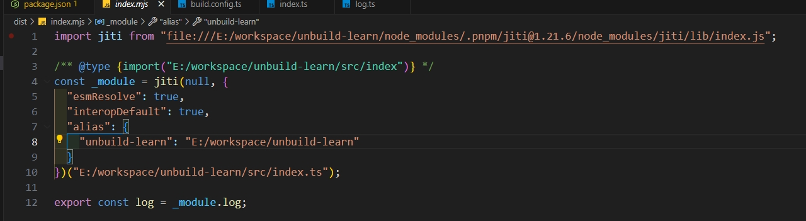

# unbuild打包工具一

在开发函数工具库等场景中，我们一般使用 rollup 工具打包，这里推荐另外一个更加方便的工具 [unbuild](https://github.com/unjs/unbuild)。其也是基于rollup打包，使用上更加方便智能


## 1、基本使用

安装：`pnpm add unbuild -D`

比如在 `/src/index.ts` 代码如下：

```text
export const log = (...args) => { console.log(...args) }
```

修改`package.json`

```json
{
  "exports": {
    ".": {
      "import": "./dist/index.mjs",
      "require": "./dist/index.cjs"
    }
  },
  "main": "./dist/index.cjs",
  "types": "./dist/index.d.ts",
  "files": [
    "dist"
  ]
}
```

执行 `unbuild` 命令即可，会自动识别`package.json` 构建出需要的内容如下，可以看到es规范、commonjs规范、ts类型全部都生成好了


## 2、配置

新建配置文件 `build.config.{js,cjs,mjs,ts,mts,cts,json}` 即可

```ts
import { defineBuildConfig } from 'unbuild'

export default defineBuildConfig({
  entries: ['src/index.ts'],
  outDir: 'dist',
})
```

### entries

源码的入口，一般就是指我们的 `/src/index.ts`

### outDir

打包后的文件夹名，一般就是我们的`dist`

### name

项目名称，感觉对构建没什么影响


> 参考文章：https://juejin.cn/post/7310412236648202249
>
> unbuild配置项：https://github.com/unjs/unbuild/blob/main/src/types.ts#L140

## 其他能力

### .1stub模式

如果遇到下面情况，那么unbuild的stub模式开启后很舒适

* 在 传统的rollup 或 monorepo项目 开发中，如果连接业务项目进行本地调试，每次改了函数库源码之后，需要重新构建打包才可以
* 在业务项目是js，而我们函数库是js

开启 `stub`也是很简单，执行`unbuild --stub` 即可，他会将dist目录的代码变成



可以看到是使用了 [jiti](https://www.npmjs.com/package/jiti) 这个库，就直接改函数库的源码即可，jiti会实时连接通道


