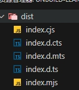
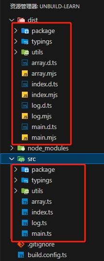
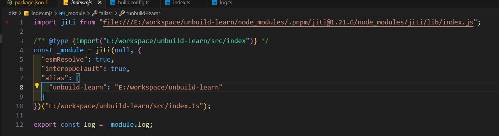

# unbuild打包工具

在开发函数工具库等场景中，我们一般使用 rollup 工具打包，这里推荐另外一个更加方便的工具 [unbuild](https://github.com/unjs/unbuild)。其也是基于rollup打包，使用上更加方便智能

一些用unbuild构建的库

* [create-vite](https://github.com/vitejs/vite/blob/main/packages/create-vite/build.config.ts)


## 1、基本使用

安装：`pnpm add unbuild -D`

比如在 `/src/index.ts` 代码如下：

```text
export const log = (...args) => { console.log(...args) }
```

修改`package.json`

```json
{
  "exports": {
    ".": {
      "import": "./dist/index.mjs",
      "require": "./dist/index.cjs"
    }
  },
  "main": "./dist/index.cjs",
  "types": "./dist/index.d.ts",
  "files": [
    "dist"
  ]
}
```

执行 `unbuild` 命令即可，会自动识别`package.json` 构建出需要的内容如下，可以看到es规范、commonjs规范、ts类型全部都生成好了



## 2、配置

新建配置文件 `build.config.{js,cjs,mjs,ts,mts,cts,json}` 即可

```ts
import { defineBuildConfig } from 'unbuild'

export default defineBuildConfig({
  entries: ['src/index.ts'],
  outDir: 'dist',
})
```

> unbuild配置项：https://github.com/unjs/unbuild/blob/main/src/types.ts#L140

### entries

源码的入口，默认是 `/src/index`

可以是一个字符串或字符串数组，比如下面配置

```ts
export default defineBuildConfig({
  entries: ['src/index.ts', 'src/main.ts'],
  outDir: 'dist',
})
```

那么入口就有2个，一个`/src/index.ts`，一个`/src/main.ts`


如果想要更多配置，可以配置成一个json对象，比如

```typescript
export default defineBuildConfig({
    entries: [
        {
            builder: 'mkdist', // mkdist builder传输文件到文件，保持原始源结构,就算没有被引入的模块也会复制到dist目录中
              input: './src/',
            outDir: './dist/'
        },
    ],
    declaration: true,
})
```

`mkdist` 构建后的目录将和源码的保持一致



如果`entries`的值是一个路径，就会自动使用mkdist构建，比如

```js
export default defineBuildConfig({
    entries: ['./src/'], // 指到了目录级别而不是某个文件
});
```


### outDir

打包后的文件夹名，默认值`dist`

### name

项目名称，感觉对构建没什么影响

### rootDir

项目根目录，配置了就会影响 `entries` 和 `outDir`，需要结合起来找

比如配置：

```ts
export default defineBuildConfig({
  entries: ['src/index.ts'],
  outDir: 'dist',
  rootDir: './haha'
})
```

那么源码入口就是`/haha/src/index.ts`，编译后的文件到`/haha/dist/index.mjs`

### clean

每次构建之前是否清空dist目录，设置false的话，就不会清空dist目录，推荐每次都清

```ts
export default defineBuildConfig({
  clean: true,
})
```

### sourcemap

是否生成map文件，默认是不生成，设置 `true` 之后就会生成map文件

```ts
export default defineBuildConfig({
  entries: ['src/index.ts'],
  sourcemap: true
});
```

### stub 和 stubOptions

使用stub模式构建，这样构建出来的会给`jiti`做链接，只需要一次构建，后续源码改动可以实时反应，一般用在开发阶段。

通过命令 `unbuild --stub` 启动

```ts
export default defineBuildConfig({
  stub: true,
  stubOptions: {}
});
```

### externals

用来指定哪些模块是外部依赖，这些模块不会被打包进去

```ts
export default defineBuildConfig({
  externals: ['lodash']
});
```

unbuild也会自动去识别`package.json`中的`dependencies | devDependencies`字段，将其依赖的视为外部依赖

### alias

设置别名路径，达到简写的目的

```ts
import { fileURLToPath } from 'url';
function resolveRoot(path: string) {
  return fileURLToPath(new URL(path, import.meta.url));
}

export default defineBuildConfig({
  alias: {
    '@utils': resolveRoot('./src/utils/'),
  }
})
```

如果是ts项目，我们还需要配置下 `tsconfig.json` 如下：

```json
{
  "compilerOptions": {
    "module": "ESNext", // module和moduleResolution需要一起配置，不然有各自路径解析问题
    "moduleResolution": "bundler",
    "baseUrl": ".",
    "paths": {
      "@utils/*": ["./src/utils/*"]
    }
  }
}
```

### replace

用来替换源码中的某些字符串，比如下面配置：

```ts
export default defineBuildConfig({
  entries: ['src/index.ts'],
  replace: {
    __DEV__: JSON.stringify({name:'我是小明'}),
  }
})
```

源码中有下面代码：

```ts
console.log('sfd', __DEV__);
```

如果是ts项目，需要给其声明好类型，在`/src/typings/global.d.ts`中声明类型

```ts
declare global {
  const __DEV__: {name: string};
}

export {}
```

那么构建之后就会变成

```ts
console.log("sfd", { "name": "\u6211\u662F\u5C0F\u660E" });
```

### failOnWarn

默认是true，设置false的话，控制台只会给警告信息不终止构建任务

### rollup

用来配置和rollup构建的选项，大致如下

- emitCJS：设置true，构建产物中也会有cjs规范的文件
- cjsBridge
- inlineDependencies
- output
- replace
- alias
- resolve
- json
- esbuild
  - target：目标版本，比如`ES2020`
  - minify：设置true，构建的是压缩版本
- commonjs
- dts

比如想要打包成umd的包，可以配置

```ts
export default defineBuildConfig({
  declaration: true,
  rollup: {
    emitCJS: true,
    inlineDependencies: true,
    esbuild: {
      target: "ES2020",
      minify: true,
    },
    output: {
      name: 'MyLibName', // 暴露在window下的变量名
      format: 'umd'
    }
  }
});
```

## preset

可以加载其他人共享的预设

### hooks

钩子函数


## 命令行配置

执行 `npx unbuild --help` 可以看出支持3个配置

```text
--stub    Stub build
--minify    Minify build
--sourcemap    Generate sourcemaps (experimental)
```


## 其他能力

### 1.stub模式

如果遇到下面情况，那么unbuild的stub模式开启后很舒适

* 在 传统的rollup 或 monorepo项目 开发中，如果连接业务项目进行本地调试，每次改了函数库源码之后，需要重新构建打包才可以
* 在业务项目是js，而我们函数库是js

开启 `stub`也是很简单，执行`unbuild --stub` 即可，他会将dist目录的代码变成



可以看到是使用了 [jiti](https://www.npmjs.com/package/jiti) 这个库，就直接改函数库的源码即可，jiti会实时连接通道


