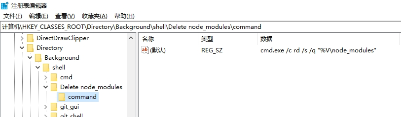
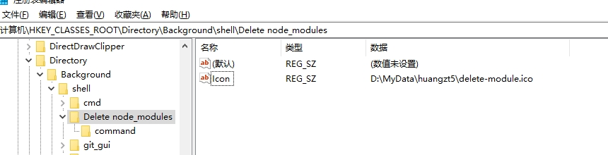
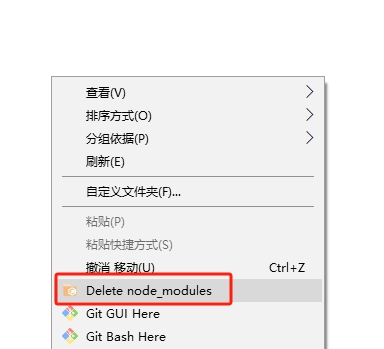

# window下快速删除node_modules

可以用cmd命令，执行 `rd /s /q node_modules` 可以快速的删除

如果不好记忆，可以将该命令添加到系统右键菜单中。具体方法如下：

1. 按 `Win + R` 键，输入 `regedit`，然后按回车键
2. 在注册表编辑器中，找到以下路径 `HKEY_CLASSES_ROOT\Directory\Background\shell`
3. 右键点击 `shell`，选择 `新建 > 项`，将其命名为 `Delete node_modules`
4. 右键点击新创建的 `Delete node_modules` 项，选择 `新建 > 项`，将其命名为 `command`。
5. 选择 `command` 项，在右侧双击 `默认`，将其值设置为：

```shell
cmd.exe /c rd /s /q "%V\node_modules"
```



注册之后，只要右键就可以看到有个 `Delete node_modules` 菜单了


我们可以为其添加一个图标，更加好识别一点，到网上找个png图片，转为ico格式，格式要求 `16*16`，比如找到 `delete-module.ico` 这个图标。

然后放到系统上某个位置，比如我们放到 `D:\MyData\xiaoming\delete-module.ico`

然后修改注册表

1. 在前面步骤创建好的 `Delete node_modules` 项
2. 在右侧窗口中，右键点击空白处，选择 `新建 > 字符串值`，将其命名为 `Icon`
3. 双击 `Icon`，将其值设置为图标文件的路径，将值设置为：

```shell
D:\MyData\xiaoming\delete-module.ico
```



这样，右键菜单就有个图标了，效果如下:

