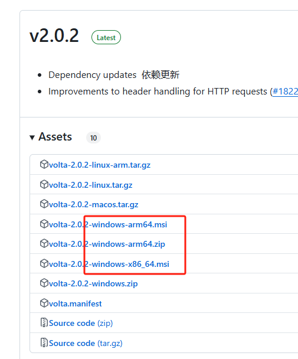
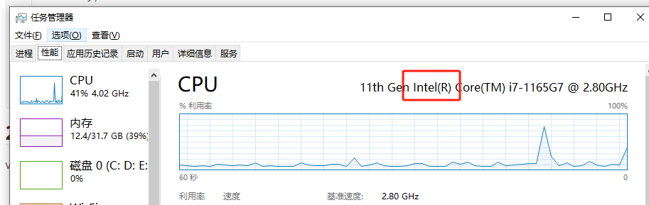
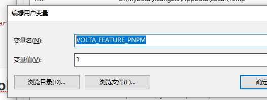

# 初步使用

volta可以自动根据项目需要切换node、pnpm版本，不需要我们手动操作

* [文档](https://docs.volta.sh/guide/getting-started)
* [下载地址](https://github.com/volta-cli/volta/releases)

## 1、安装

在下载地址列表中我们看到window有几个安装包



那么怎么确定我们的电脑要安装 `arm` 还是 `x86` 呢？

可以在电脑的 `任务栏 - 右键 - 任务管理器 - 性能 - CPU` 看出CPU信息

- 如果显示 **Intel** 或 **AMD** → 选择 `x86_64`。
- 如果显示 **Snapdragon** 或 **Microsoft SQ** → 选择 `ARM64`



如上图，我们的是 `Intel` ，所以应该安装 `x86` 的


下载后，直接双击安装，安装后的目录一般是 `C:\Program Files\Volta`，如果不是可以执行 `where volta` 查看目录。

除了安装目录，还会有一个存配置的目录，一般是在系统的用户目录下。输入`cd %LOCALAPPDATA%`，进入用户目录，即在`D:\MyData\huangxiaomign5\AppData\Local\Volta` 中新建 `hooks.json`，内容如下：

```json
{
    "node": {
        "index": {
            "template": "https://mirrors.tuna.tsinghua.edu.cn/nodejs-release/index.json"
        },
        "distro": {
            "template": "https://mirrors.tuna.tsinghua.edu.cn/nodejs-release/v{{version}}/node-v{{version}}-{{os}}-{{arch}}.zip"
        }
    }
}
```

## 2、volta pin pnpm提示不支持

volta默认不支持pnpm的版本约束，需要在环境变量设置 `VOLTA_FEATURE_PNPM=1`




