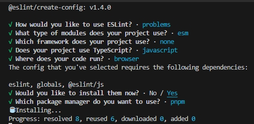

# 安装使用

这里所有eslint的都是9以上的，eslint9需要node20以上版本


## 纯手动设置（不推荐）

1.安装依赖：`pnpm add -D eslint`

2.创建文件`eslint.config.mjs` 内容如下

```js
export default [
  {
    rules: {
      "no-unused-vars": "error",
      "no-undef": "error"
    }
  }
]
```

3.在`/src/index.js`特意写不符合规范的代码

```js
const cname = 23; // 提示 'cname' is assigned a value but never used
```

4.执行命令 `npx eslint` 即可

如果需要使用npm上定义的，也可以手动安装，比如使用官方提供的 [@eslint/js](https://www.npmjs.com/package/@eslint/js) 的规则

安装：`pnpm add -D @eslint/js`，修改 `eslint.config.mjs`

```js
import pluginJs from "@eslint/js";

export default [
  pluginJs.configs.recommended,
  {
    rules: {
      "no-unused-vars": "error",
      "no-undef": "error"
    }
  }
]
```

那么特意写个

```js
const foo = 'index.js';
if (foo) { // 提示no-empty
}
```


## 使用脚手架创建

eslint官方也提供了脚手架创建，执行命令 `pnpm create @eslint/config@latest` 执行后会咨询需要的各种场景，根据需要选择即可



比如上面我们选择了浏览器运行的纯js项目，那么会自动为我们创建`eslint.config.mjs`

```js
import globals from "globals";
import pluginJs from "@eslint/js";

/** @type {import('eslint').Linter.Config[]} */
export default [
  {languageOptions: { globals: globals.browser }},
  pluginJs.configs.recommended,
];
```

在eslint配置的同时，还需要使用一些社区的包，比如社区的[eslint-config-standard](https://www.npmjs.com/package/eslint-config-standard)，则可以用下面的命令：

> eslint-config-standard截止目前20241107，还没兼容eslint9

```shell
# npm7+的
npm init @eslint/config@latest -- --config eslint-config-standard 

# pnpm的
pnpm add -D @eslint/config
pnpm exec @eslint/config --config eslint-config-standard
```

