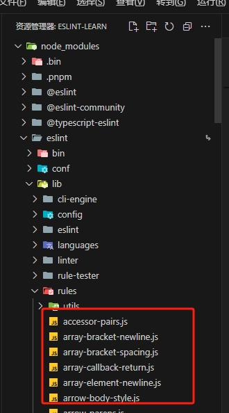

# 规则配置

在配置文件`eslint.config.mjs`中，需要暴露一个数组，数组中每一元素称为配置对象，可以由多个配置对象组合而成

```js
export default [
	{}, // 配置对象1
	{}, // 配置对象2
]
```

## 配置对象

```js
export default [
	{
    name,
    files,
    ignores,
    languageOptions,
    linterOptions,
    processor，
    plugins,
    rules,
    settings
  },
]
```

### files属性 和 ignores属性

使用的是 [minimatch](https://www.npmjs.com/package/minimatch) 语法。

默认情况下，eslint 会对与模式 `**/*.js`、`**/*.cjs` 和 `**/*.mjs` 匹配的文件，因此默认情况下，`ts`、`vue` 文件不会进行eslint检查

比如下面配置：

```js
export default [
  {
    files: ["src/**/*.js"],
    ignores: ["**/*.config.js", "!**/eslint.config.js"],
    rules: { semi: "error" }
  }
];
```

> 匹配 `src` 目录中的所有 JavaScript 文件，以 `.config.js` 结尾的文件除外，但又排除 `eslint.config.js` 该文件仍然应用了eslint

需要注意，如果想要设置忽略某个文件下所有文件，或者校验某个文件夹内所有文件，以 `src文件夹` 为例子应该用 `src/**` 这种写法，而不是用 `src/` 这种写法


没有扩展名的文件可以与模式 `!(*.*)` 匹配

```js
{
  files: ["**/!(*.*)"]
}
```


属性

## rules属性

> 官方的rule列表可以看[规则](https://nodejs.cn/eslint/rules/array-callback-return/)

规则的实现代码可以看eslint源码，每个规则本质上是一个`create()`函数位置如下，一共有280多个规则：




在eslint规则中

```js
export default [
  {
     rules: {
       "no-unused-vars": "error"
     }
  }
];
```

规则级别分下面几种：

* `"off"` 或 `0` - 关闭规则
* `"warn"` 或 `1` - 打开规则作为警告
* `"error"` 或 `2` - 打开规则作为错误