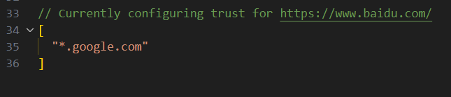

# 建议修改的配置

## 1.文件夹展示方式

默认情况下，比如文件夹 `/a/b/c/index.js`，vscode对于文件层展示如下，是放在一起展示


我们可以修改 `Compact Folders` ，将勾选去掉，变成按照文件层级展示


## 2.tab展示方式

当我们打开文件比较多，vscode模式是下面的展示方式，通过滚动选择文件


我们可以通过勾选  `wrap tab`，这样多的就换行展示


用习惯了一行展示，但是一行展示溢出的时候滚动条太小，不方便操作，我们可以通过设置`Title Scrollbar Sizing` 改大些


效果如下，可以看到滚动条就变大很多了：


## 3.最近项目

一般我们想要打开历史的项目，一种方式是 `File -> Open Recent`


vscode提供了快捷键 `ctrl + R` ，而且这种方式的，支持搜索和不受数量控制


如果想要新开窗口，可以 `ctrl+鼠标点击` 或 `ctrl+回车`

## 4.复制路径的连接符

我们复制相对路径的时候，复制出来连是 `a\b\c\index.js`，


但实际上，在web开发中使用 `/` 更多，我们可以去修改下配置 `Copy Relative Path Separator`，改为 `/`


现在再复制路径，得到的就是 `a/b/c/index.js` 了

## 5. 设置信任域url

在vscode中，如果有一个url，可以点击超链接打开该url，但是会有一个弹窗确认

```md
https://www.baidu.com/
```


我们可以点击 `Configure Trested Domains`，选择将域名加入白名单，这里的`Manage Trusted Domains` 可以让我们自己配置



```json
[
  '*'
]
```

可以配置自己公司的域名，或者配置成 `[*]` 表示所有域名都是白名单

## 6. auto rename tag内置

vscode已经内置了这个功能，不需要单独再安装，勾选上 `Linked Editing` 即可


