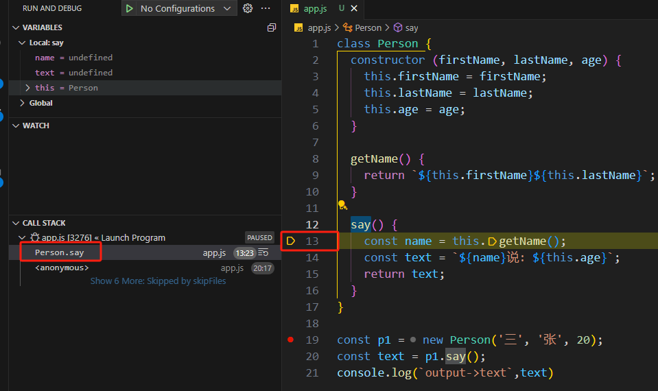

# 调试模式

在vscode的debug面板中，我们可以用来调试程序，方便定位bug和梳理逻辑


## 简单的调试

比如有下面 `app.js`的 node代码

```js
class Person {
  constructor (firstName, lastName, age) {
    this.firstName = firstName;
    this.lastName = lastName;
    this.age = age;
  }

  getName() {
    return `${this.firstName}${this.lastName}`;
  }

  say() {
    const name = this.getName();
    const text = `${name}说: ${this.age}`;
    return text;
  }
}

const p1 = new Person('三', '张', 20);
const text = p1.say();
console.log(`output->text`,text)
```

因为vscode自带就是支持nodejs的，因此可以直接打断点，然后debug


之后就会进入这样的界面


## 条件断点

比如现在有个js，代码如下：

```js
let num = 0;
for (let i =0; i< 1000; i++) {
  num = i;
}
```

如果我们想要关注当 `i=50` 的时候，我们需要在第3行断点，那么就需要从 `i=0` 开始一直点击50次。

这个时候条件断点就起作用了，我们在右键选择`Add Conditional Breakpoint`。


然后输入一个条件，按照需要，我们就输入 `i === 50`


那么这个断点，就会等到 `i === 50` 的时候才起作用


## 行断点

这种主要用在那种一行代码出现多个函数调用的场景，比如下面代码

```js
class Demo {
  static getFoo () {
    return 'foo'
  }

  static getBoo () {
    return 'boo'
  }

  static getCoo () {
    return 'Coo'
  }
}

const info = Demo.getFoo() + Demo.getBoo() + Demo.getCoo();
console.log(`output->info`,info)
```

在第15行就出现了同一行代码，多个函数调用。

而我们指向调试最后一个函数的调用，那么我们将光标点在 `getCoo()` 前面，然后选择 `Run - New Breakpoint - Inline Breakpoint`


再启动debug，就会直接到对应光标的位置


## Call Stack

首先我们来认识下Call Stack，这里展示的是js的函数调用栈。我们知道js函数的调用时候，是进入栈中的，能函数执行结束就从栈中出去

>  比如上面代码，首先入口函数，即main函数。然后执行 `new Person()`。
>
> 会调用构造函数，这个时候 `Person函数` 就入栈了。
>
> 然后执行 `say()`，这个时候 `say函数` 入栈了。
>
> 而 `say()` 中又调用了 `this.getName()`，因此 `getName函数` 入栈，`this.getName()`执行完，`getName函数` 出栈。
>
> 接着执行完 `say()`，那么  `say函数` 出栈。

以上面代码为例，我们通过点击下面的图标（或按`F11`）可以一步步看调用栈的变化


首先启动debug，出现下面界面


看到 `<anonymouse>` 这个是匿名函数，在这里就是我们说的主函数（main函数）。

按 `F11` 进入下一步，执行到构造函数里面，这个时候看到 `Person.constructor` 入栈了。


再3次按 `F11`，代码执行下一步，可以看到栈依旧在 `main -> Person.constructor` `


再按 `F11`，构造函数执行完成了，这个时候如下图看到执行回到main函数了，`Person.constructor` 在栈中也消失了。


继续 `F11`，结果如下图，可以看到执行到了 `say()` 里面了，这个时候 `say()` 入栈



继续 `F11` ，代码进入了 `getName()`里面，可以看到 `getName()` 入栈了


继续 `F11`，代码回到 `say()`，此时 `getName()` 出栈


因此，从调用栈，我们可以看出目前的调用栈顺序。

## Variables 和 Watch

Variables这里展示的是当前函数中所拥有的变量

比如重新debug，可以看到在main函数的时候所拥有的变量


继续执行，可以看到作用域的变量一直在变化，比如执行到下面步骤时


那么 Watch有什么用呢？有时候Variables中的变量内容比较多，我们可以在Watch中单独打印出某个我们关心的，方便看到内容

比如在 Watch 中双击后输入 `this.age`，可以看到内容


而且Watch的好处是下次重新debug的时候，Watch的内容不会消失。

除了Watch，我们也可以在控制台这里直接输入变量查看，这里区域比较大，查看对象之类的也方便很多

