# 调试launch

## 自带的变量

- `${userHome}` - 用户主文件夹的路径
- `${workspaceFolder}` - 在 VS Code 中打开的文件夹的路径
- `${file}` - 当前打开的文件
- `${fileWorkspaceFolder}` - 当前打开文件的工作区文件夹
- `${cwd}` - VS Code 启动时任务运行器的当前工作目录
- `${lineNumber}` - 活动文件中当前选定的行号
- `${selectedText}` - 活动文件中当前选定的文本
- `${execPath}` - 正在运行的 VS Code 可执行文件的路径

## 调试普通node程序

这里介绍vscode的 `launch.json` 的作用

比如现在有node代码如下

```js
class Person {
  constructor (firstName, lastName, age) {
    this.firstName = firstName;
    this.lastName = lastName;
    this.age = age;
  }

  getName() {
    return `${this.firstName}${this.lastName}`;
  }

  say() {
    const name = this.getName();
    const text = `${name}说: ${this.age}`;
    return text;
  }
}

const p1 = new Person('三', '张', 20);
const text = p1.say();
console.log(`output->text`,text)
```

我们用vscode打了断点

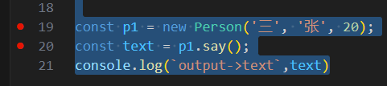

对于node，要执行上面的代码，我们只需要执行 `node app.js` 即可，但是遇到上面的断点是不是停止的

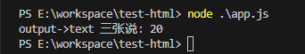

这个时候就需要使用到 vscode 的 `lanuch.json` 了

点击创建一个lanuch配置，然后选择node调试

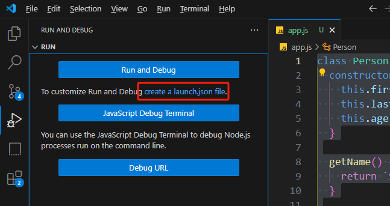

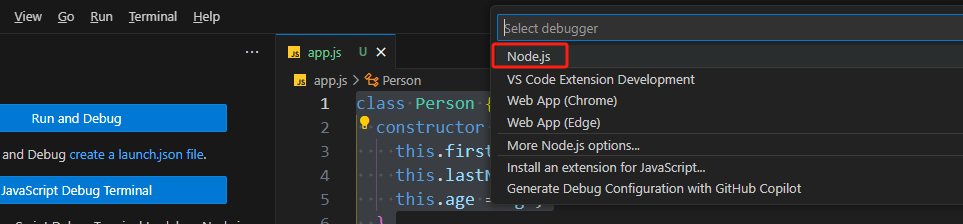

会自动在 `.vscode/lanuch.json` 生产下面的配置

```json
{
  "version": "0.2.0",   // 这里是固定的不用理
  "configurations": [
    {
      "type": "node",  // 我们上面调试的是node所以这里是node
      "request": "launch",
      "name": "Launch Program",
      "skipFiles": [
        "<node_internals>/**"
      ],
      "program": "${workspaceFolder}\\app.js" // 这里会用上面的type即node去执行，也就是 node 根目录/app.js
    }
  ]
}
```

再启动调试，就可以成功进入断点了。

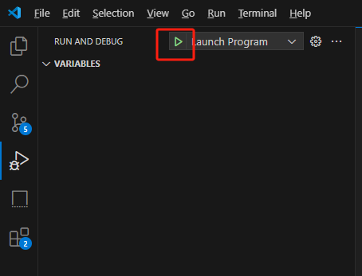

## 调试web node程序

比如现在有一个web node程序，代码如下：

```ts
const http = require('http');

const server = http.createServer((req, res) => {
  console.log(11);
  console.log(11);
  res.end('hello world')
});

server.listen(3000, () => {
  console.log('listen:3000')
})
```

我们除了前面讲的调试，更多的时候，我们是通过某个命令启动服务，比如这里我们在cmd执行`npm run dev` 启动服务

这个时候vscode的断点就会不起作用，那么我们怎么处理好？

我们可以使用 `type=attach` 的调试方式，具体操作如下，新增一个 `Attach to Process` 的配置 

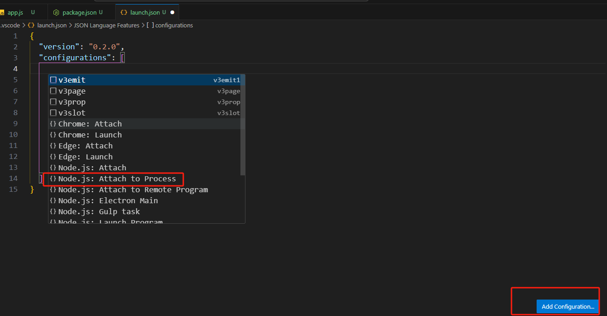

新增配置如下

```json
{
  "version": "0.2.0",
  "configurations": [
    {
      "name": "Attach by Process ID",
      "processId": "${command:PickProcess}",
      "request": "attach",
      "skipFiles": [
        "<node_internals>/**"
      ],
      "type": "node"
    }
  ]
}
```

接着启动debug并选择我们上面的 `pnpm run dev`

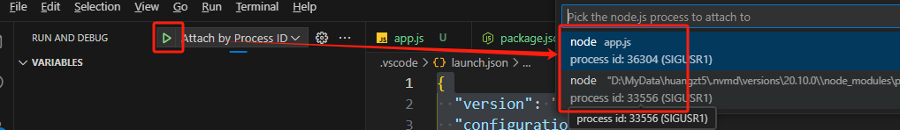

此时vscode会再启动一个ws线程服务，然后将该服务附加到我们启动的 `http://localhost:3000` 服务中。

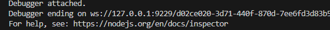

这个时候，再访问 `http://localhost:3000`  端口的时候，就会进入debug了

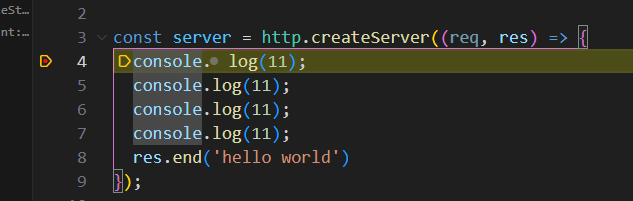

## 调试vscode扩展插件

配置 `launch.json` 如下：

```json
{
	"version": "0.2.0",
	"configurations": [
		{
			"name": "Run Extension",
			"type": "extensionHost",
			"request": "launch",
			"args": [
				"--extensionDevelopmentPath=${workspaceFolder}",
				"--disable-extensions"
			],
			"outFiles": [
				"${workspaceFolder}/dist/**/*.js"
			]
		}
	]
}
```

然后按F5之后，就会启动一个新vscode调试窗口，如果我们改了代码，在新窗口按 `ctrl + R` 就可以刷新


## 调试vue程序

#### vite项目

如果是vite项目，比如我们执行 `npm dev` 启动了 `http://localhost:5173/` 去访问项目

那么可以可以按照下面创建 `launch.json` ，浏览器选择自己喜欢的即可：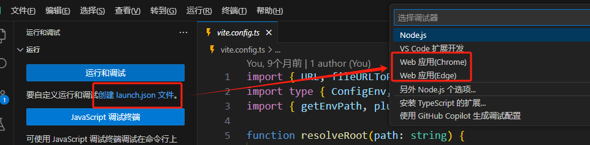

选择之后，vscode会自动创建好 `launch.json`，内容如下：

```json
{
  "version": "0.2.0",
  "configurations": [
    {
      "type": "msedge",
      "request": "launch",
      "name": "针对 localhost 启动 Edge",
      "url": "http://localhost:8080",
      "webRoot": "${workspaceFolder}"
    }
  ]
}
```

我们的开发目录一般都在 `/src` 里面，因此这里需要改下 `webRoot`。

端口也需要改为我们启动的端口改为如下：

```json
{
  "url": "http://localhost:5173",
  "webRoot": "${workspaceFolder}/src"
}
```

到这里配置的就完成了，接着我们启动调试模式

我们照常执行 `npm run dev` 启动端口

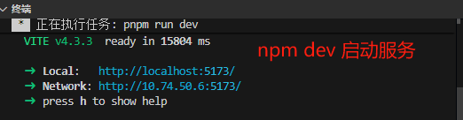

然后按 `F5` 启动调试，vscode会新开一个edge浏览器，我们在新的浏览器访问 `http://localhost:5173`

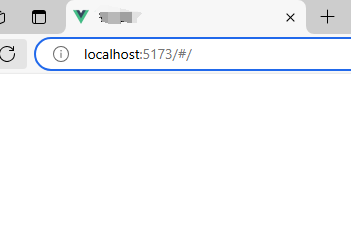


并在vscode打上断点，这样就可以在vscode调试vue代码了

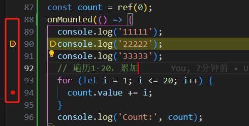

