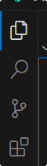

# 快捷键和内置命令

查看vscode所有自带的快捷键：[mac快捷键](https://code.visualstudio.com/shortcuts/keyboard-shortcuts-macos.pdf) / [window快捷键](https://code.visualstudio.com/shortcuts/keyboard-shortcuts-windows.pdf)

也可以在vscode的help菜单中打开，位置如下：

## 常见的快捷键功能

* `Ctrl + tab`：可以在现在打开的tab中相互切换

* `alt + Left箭` 和 `alt + Right箭` 可以快速跳到上次修改代码/下次修改代码的行数
* 先 `ctrl + K` 一会再 `ctrl + S`：可以查看目前vscode所有的快捷键（vscode自带+扩展加的快捷键）

* 左侧菜单的几个快捷键，记住下面几个就可以
  * `ctrl + shift + e`：项目文件
  * `ctrl + shift + f`：搜索
  * `ctrl + shift + g`：git管理
  * `ctrl + shift +x`：扩展管理

## 内置命令

* `go back`：该命令可以回到上一次编辑光标的位置，对应的快捷键是 `Alt + 左箭头`

