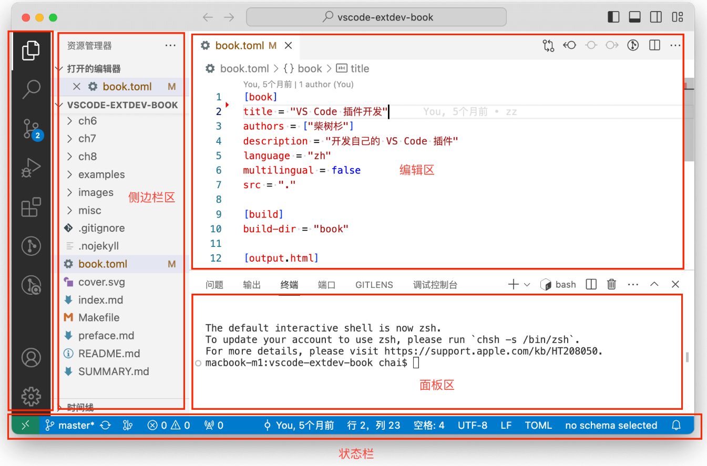

# 创建插件项目

安装yo：执行 `npm install -g yo generator-code`

创建项目：执行 `yo code` 提供下面的选项

```text
> New Extension (TypeScript)
  New Extension (JavaScript)
  New Color Theme
  New Language Support
  New Code Snippets
  New Keymap
  New Extension Pack
  New Language Pack (Localization)
  New Web Extension (TypeScript)      # 开发web版本的vscode插件
  New Notebook Renderer (TypeScript)
```

## web版本插件

vscode推出了纯web版本的编辑器，地址：[https://vscode.dev/](https://vscode.dev/) ，因为受浏览器限制，很多普通插件功能实现不一样，比如没有node、没有操作本地文件。

因此如果想要开发一个插件给web版本的vscode用，则需要这里的选项，修改 `package.json`

```json
{
  "main": "./extension.js",
  "browser": "./extension.js", // 指向web插件的入口
}
```

也可以在 `yo code` 的时候选择 `New Web Extension (TypeScript) `


## vscode界面介绍



上图是vscode的主界面介绍，包含各个面板：

- 活动栏：左侧是一个活动栏
- 侧边栏：与活动栏强关联的是侧边栏区
- 编辑器：右侧的上部是VS Code的代码编辑区
- 面板：编辑器区域下方用于查看视图的附加面板空间
- 状态栏：底部长条是状态栏