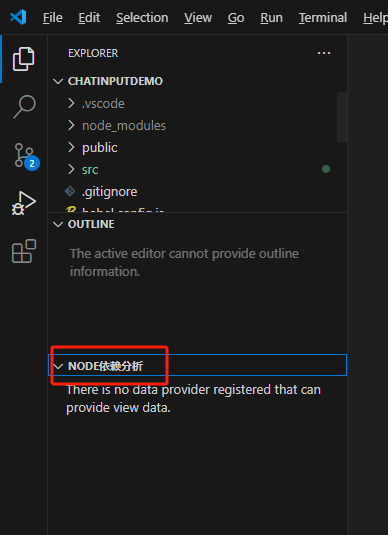
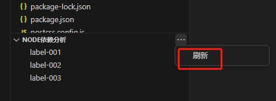
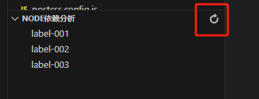
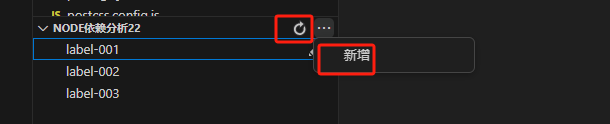
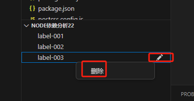
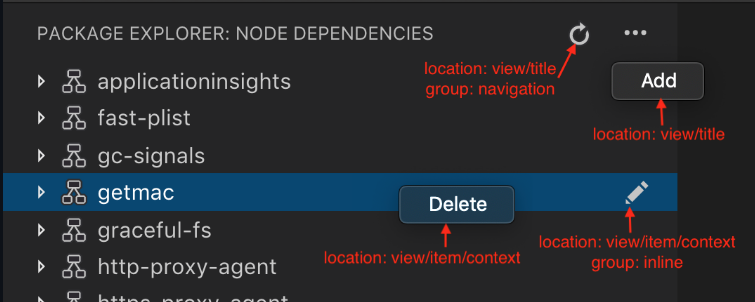
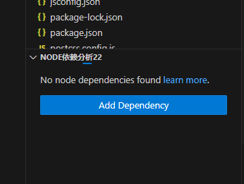

# treeView视图

Tree View Api 定义vscode侧边栏的显示内容，以tree型结构展示

需要设置在 `contributes.views.explorer` ，比如设置下面

```json
{
  "contributes": {
    "views": {
      "explorer": [
        {
          "id": "nodeDependencies",
          "name": "Node Dependencies"
        }
      ]
    }
  }
}
```

> 如果您的扩展针对的是 VS Code 1.74 之前的版本，您必须显式地在 `activationEvents` 中列出 `onView:nodeDependencies`

那么对应在vscode可以看到



可以为视图指定一个标识符和名称，并可以向以下位置做出贡献

* `explorer` : 侧边栏中的资源管理器视图
* `debug` : 侧边栏中的运行和调试视图
* `scm` : 侧边栏中的源代码控制视图
* `test` : 侧边栏中的测试探索视图
* `自定义`：需要和 `contributes.viewsContainers` 配合使用就可以实现添加指定菜单的图标

指定上面的值，就可以控制treeView去到对应bar里面

## treeDataProvider

有了上面的view入口之后，我们需要为这个view提供数据。在 `/src/extension.ts` 中这么处理

* 通过 `vscode.window.registerTreeDataProvider(<视图ID>, <数据处理>)` 注册视图处理

数据处理需要至少提供2个方法：`getChildren(element?: T): ProviderResult<T[]>` 和 `getTreeItem(element: T): TreeItem | Thenable<TreeItem>`

```ts
import * as vscode from 'vscode';
import { TreeItemCollapsibleState } from 'vscode';

export function activate(context: vscode.ExtensionContext) {
	vscode.window.registerTreeDataProvider('nodeDependencies', {
		getTreeItem(element: vscode.TreeItem) {
			return element;
		},
		getChildren(element?: vscode.TreeItem) {
			if (!element) {
				return Promise.resolve([
					{
						label: 'label-001',
						collapsibleState: TreeItemCollapsibleState.None,
            tooltip: "hover: 单纯的字符串 ",
					},
					{
						label: 'label-002-Collapsed',
						collapsibleState: TreeItemCollapsibleState.Collapsed,
            tooltip: "hover: 单纯的字符串 ",
					},
					{
						label: 'label-003-Expanded',
						collapsibleState: TreeItemCollapsibleState.Expanded,
            tooltip: "hover: 单纯的字符串 ",
					}
				]);
			}
			return Promise.resolve([
				{
					label: `父级（${element.label}}）-x`
				}
			]);
		}
	});
}
```

1. 当用户打开树视图时， `getChildren` 方法将被调用而不传 `element` 参数 ，因此当 `element` 为空的时候返回的应该是根目录。

   如果返回的不是 `{label}` 属性，可以在 `getTreeItem()` 方法加工处理下，比如：

   ```ts
   interface Person {
   	cname: string;
   }
   export function activate(context: vscode.ExtensionContext) {
   	vscode.window.registerTreeDataProvider('nodeDependencies', {
   		getTreeItem(element: Person) {
   			return {...element, label: element.cname}; // vscode回取label这个字段作为文案展示
   		},
   		getChildren(element?: Person) {
   			if (!element) {
   				return [{ cname: 'label-001', }, { cname: 'label-002-Collapsed', }, { cname: 'label-003-Expanded', }];
   			}
   		}
   	});
   }
   ```

2. 每一项中的 `collapsibleState` 属性是控制是否有下一级的配置。其值有3种情况：
   * `TreeItemCollapsibleState.Collapsed`：折叠状态。等用户点击展开图标的时候才会触发 `getChildren()` 方法
   * `TreeItemCollapsibleState.Expanded`：展开状态，会自动再次触发 `getChildren()` 方法
   * `TreeItemCollapsibleState.None`：没有子项


## 注册视图

注册视图用的API有 `vscode.window.createTreeView` 和上面 `vscode.window.registerTreeDataProvider`。

`vscode.window.createTreeView`注册之后会返回一个 `TreeView` 对象，可以使用该对象进行更细节上的交互，而`vscode.window.registerTreeDataProvider` 只适合只需要提供数据的简单场景

> 那是不是我们就干脆用`vscode.window.createTreeView` 好了

```ts
vscode.window.registerTreeDataProvider('nodeDependencies', {
  getTreeItem() {},
  getChildren() {},
});

// 返回一个对象，基于该对象可以更多控制
const treeView = vscode.window.createTreeView('nodeDependencies', {
  treeDataProvider: {
    getTreeItem() {},
    getChildren() {},
  },
  showCollapseAll: true, // 全部view视图都折叠收起来
});
treeView.onDidChangeSelection(event => {
  console.log('Selection changed:', event.selection);
});
treeView.onDidChangeVisibility(event => {
  console.log('Visibility changed:', event.visible);
});
```


## 更新TreeView内容

在 `package.josn` 中可以为treeView添加一些操作，比如现在我们将添加一个【刷新】的动作

修改 `package.json` 如下：

```json
{
  "contributes": {
    "menus": {
      "view/title": [
        {
          "command": "nodeDependencies.refreshEntry",
          "when": "view == nodeDependencies"
        }
      ]
    },
    "commands": [
      {
        "command": "nodeDependencies.refreshEntry",
        "title": "刷新"
      }
    ]
  }
}
```

上面配置为treeView添加了一个【刷新】菜单，效果如下：



当然我们可以将其转为图标的方式展示，修改配置：

```json
{
  "contributes": {
    "menus": {
      "view/title": [
        {
          "command": "nodeDependencies.refreshEntry",
					"when": "view == nodeDependencies",
          "group": "navigation" // 加上这句
        }
      ]
    },
    "commands": [
      {
        "command": "nodeDependencies.refreshEntry",
				"title": "刷新",
        "icon": {    // 加上这icon配置
					"light": "resources/light/refresh.svg",
					"dark": "resources/dark/refresh.svg"
				}
      }
    ]
  }
}
```

展示效果如下：



点击菜单或图标，vscode会去执行 `nodeDependencies.refreshEntry` 这条命令，因此我们需要实现该命令

```ts
import * as vscode from "vscode";
import { TreeItemCollapsibleState } from "vscode";
interface Person {
  label: string;
}
export function activate(context: vscode.ExtensionContext) {
  const myEmit = new vscode.EventEmitter<void>();
  vscode.window.registerTreeDataProvider('nodeDependencies', {
    onDidChangeTreeData: myEmit.event,
  	getTreeItem(element: Person) {
  		return element;
  	},
  	getChildren(element?: Person) {
  		if (!element) {
  			return [
  				{ label: 'label-001', },
  				{ label: 'label-002', },
  				{ label: 'label-003', }
  			];
  		}
  	}
  });

  vscode.commands.registerCommand('nodeDependencies.refreshEntry', () => {
    myEmit.fire();
  });
}
```

这里通过 `new vscode.EventEmitter()` 创建和触发自定义事件，并监听该事件。

`onDidChangeTreeData?: Event<T | undefined | null | void>` 是一个事件，用于通知 vscode 树视图的数据已经发生变化。这个事件通常与 `vscode.EventEmitter` 一起使用，当数据发生变化时触发该事件，VS Code 会重新调用 `getChildren` 和 `getTreeItem` 方法来更新树视图。

## 控制操作栏的位置

在 `package.json` 中，通过 `view/title` 控制显示操作的位置，可选值有 `"group": "navigation"`，其余都会放在 `...` 菜单中

比如下面配置：

```json
{
  "contributes": {
    "menus": {
      "view/title": [
        {
          "command": "nodeDependencies.refreshEntry",
					"when": "view == nodeDependencies",
          "group": "navigation"
        },
        {
          "command": "nodeDependencies.add",
					"when": "view == nodeDependencies"
        }
      ]
    },
    "commands": [
      {
        "command": "nodeDependencies.refreshEntry",
				"title": "刷新",
        "icon": "resources/dark/refresh.svg"
      },
      {
        "command": "nodeDependencies.add",
				"title": "新增"
      },
    ]
  }
}
```

展示效果如下，【刷新】图标固定展示在顶部操作栏，【新增】则需要通过点击 `...` 出现的菜单里面：



通过 `view/item/context` 控制每个 item 的操作功能，比如配置如下：

```json
{
  "menus": {
    "view/item/context": [
      {
        "command": "nodeDependencies.remove",
        "when": "view == nodeDependencies"
      },
      {
        "command": "nodeDependencies.edit",
        "when": "view == nodeDependencies",
        "group": "inline"
      }
    ]
  },
  "commands": [
    {
      "command": "nodeDependencies.remove",
      "title": "删除"
    },
    {
      "command": "nodeDependencies.edit",
      "title": "编辑",
      "icon": "resources/dark/edit.svg"
    }
  ]
}
```

效果如下，【编辑edit】图标一直展示在每一个item后面，而【删除】则需要鼠标右键菜单里面：



总体上，位置可以用下面的这个图记忆



默认情况下，动作按字母顺序排列。要指定不同的排序顺序，请在组后面添加 `@` ，随后是您想要的排序顺序。例如， `navigation@3` 将使该动作在 `navigation` 组中显示为第 3 位。您可以通过创建不同的组进一步将 `...` 菜单中的项目分开。这些组名是任意的，并且按照组名的字母顺序排列。

> 注意：如果您想为特定的树项显示一个操作，可以通过使用 `TreeItem.contextValue` 定义树项的上下文来实现，并可以在 `when` 表达式中为键 `viewItem` 指定上下文值。
>
> ```json
> "contributes": {
>   "menus": {
>     "view/item/context": [
>       {
>         "command": "nodeDependencies.deleteEntry",
>         "when": "view == nodeDependencies && viewItem == dependency"
>       }
>     ]
>   }
> }
> ```


## 为空展示提示语

如果您的视图可以为空，或者您想向另一个扩展的空视图添加欢迎内容，您可以贡献 `viewsWelcome` 内容。空视图是没有 `TreeView.message` 和空树的视图。

```json
"contributes": {
  "viewsWelcome": [
    {
      "view": "nodeDependencies",
      "contents": "No node dependencies found [learn more](https://www.npmjs.com/).\n[Add Dependency](command:nodeDependencies.addEntry)"
    }
  ]
}
```

当我们的treeView数据为空的时候，就会展示成 contents 的内容，支持md格式

