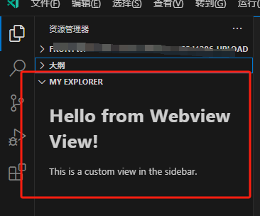

# webview视图

除了上节课说的 treeView视图，我们还可以创建一个webview视图，这种webview视图，更自由自定义

和创建treeView视图一样，但我们需要在加一个 `{ "type": "webview" }` 

首先在 `package.json` 中声明

```json
{
  "contributes": {
    "views": {
      "explorer": [
        {
          "id": "my-extenion.explorer",
          "name": "My Explorer",
          "type": "webview" // 必须加上这个
        }
      ]
    }
  }
}
```

然后在代码中使用 `vscode.window.registerWebviewViewProvider(<webviewID>, <配置>)` 之后，将返回结果给 `context.subscriptions.push()`

代码如下：

```js
import * as vscode from 'vscode';

function getHtmlForWebview() {
  return `
    <!DOCTYPE html>
    <html lang="en">
    <head>
        <meta charset="UTF-8">
        <meta name="viewport" content="width=device-width, initial-scale=1.0">
        <title>Webview View</title>
    </head>
    <body>
        <h1>Hello from Webview View!</h1>
        <p>This is a custom view in the sidebar.</p>
    </body>
    </html>
    `;
}

export function activate(context: vscode.ExtensionContext) {
  context.subscriptions.push(
    vscode.window.registerWebviewViewProvider(
      'my-extenion.explorer', // 需与 package.json 中的视图 ID 对应
      {
        resolveWebviewView(webviewView, context, token) {
          webviewView.webview.options = {
            enableScripts: true, // 允许 Webview 使用 JavaScript
          };
          // 设置 Webview 的 HTML 内容
          webviewView.webview.html = getHtmlForWebview();
        }
      }
    )
  );
}

```

实现效果如下：



**如果是ts，**我们最好通过实现 `implements vscode.WebviewViewProvider`这个类，这样更加规范化，代码如下：

```ts
import * as vscode from 'vscode';

export function activate(context: vscode.ExtensionContext) {
  // 注册 Webview View Provider
  context.subscriptions.push(
    vscode.window.registerWebviewViewProvider(
      'my-extenion.explorer', // 视图 ID，需与 package.json 中的视图 ID 对应
      new MyWebviewViewProvider(context)
    )
  );
}

class MyWebviewViewProvider implements vscode.WebviewViewProvider {
  private _context: vscode.ExtensionContext;

  constructor(context: vscode.ExtensionContext) {
    this._context = context;
  }

  // 实现 resolveWebviewView 方法
  resolveWebviewView(webviewView: vscode.WebviewView, context: vscode.WebviewViewResolveContext, token: vscode.CancellationToken) {
    // 设置 Webview 的 HTML 内容
    webviewView.webview.options = {
      enableScripts: true, // 允许 Webview 使用 JavaScript
    };

    webviewView.webview.html = this.getHtmlForWebview();
  }

  // 定义 Webview 的 HTML 内容
  private getHtmlForWebview(): string {
    return `
      <!DOCTYPE html>
      <html lang="en">
      <head>
          <meta charset="UTF-8">
          <meta name="viewport" content="width=device-width, initial-scale=1.0">
          <title>Webview View</title>
      </head>
      <body>
          <h1>Hello from Webview View!</h1>
          <p>This is a custom view in the sidebar.</p>
      </body>
      </html>
    `;
  }
}
```

