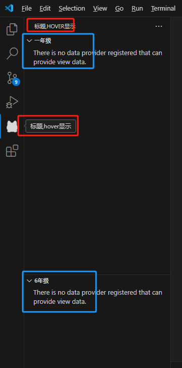

# viewContainer视图

ViewContainer容器值的是vscode最左侧的菜单栏，需要配置 `contributes.viewsContainers` 并配套和 `contributes.views` 一起使用。

并且需要理解前面的 `treeView视图`

## 简单例子

首先在 `package.json`，定义好 `contributes.viewsContainers` 和 `contributes.views`

```json
{
  "contributes": {
    "viewsContainers": {
      "activitybar": [
        {
          "id": "school",
          "title": "标题,hover显示",
          "icon": "images/school.png"
        }
      ]
    },
    "views": {
      // key要和viewsContainers的id对应
      "school": [
        { "id": "yiNianJi", "name": "一年级" },
        { "id": "liuNianji", "name": "6年级" }
      ]
    }
  }
}
```



效果如上，定义的title会展示在头部作为标题，如果有多个 `view` 就会平分屏幕空间

至于每个view中的内容，就和`treeView视图`是一样的

 