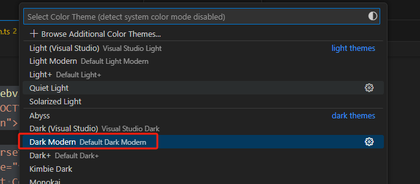

# webview视图

vscode运行我们指定定义一个webview窗口，就像iframe一样


## 自定义webview

`vscode.window.createWebviewPanel` 函数在编辑器中创建并显示一个 webview

```ts
import * as vscode from 'vscode';

export function activate(context: vscode.ExtensionContext) {
  context.subscriptions.push(
    vscode.commands.registerCommand('catCoding.start', () => {
      // Create and show panel
      const panel = vscode.window.createWebviewPanel(
        'catCoding',   // 这个webPanel的id
        'my标题',       // 展示在tab上的标题
        vscode.ViewColumn.One,
        {}
      );

      // And set its HTML content
      panel.webview.html = getWebviewContent();
      panel.title = 'my标题1'; // 设置tab的标题
    })
  );
}

function getWebviewContent() {
  return `<!DOCTYPE html>
<html lang="en">
<head>
    <meta charset="UTF-8">
    <meta name="viewport" content="width=device-width, initial-scale=1.0">
    <title>Cat Coding</title>
</head>
<body>
    
</body>
</html>`;
}
```

## WebviewPanel对象

通过 `vscode.window.createWebviewPanel()` 返回一个WebviewPanel对象，该对象上有下面的属性

* `visible`：是否处于激活可见状态

WebviewPanel对象上的方法

* `dispose()`：关闭webview

WebviewPanel对象上的监听函数

* `onDidDispose()`：监听webview销毁
* `onDidChangeViewState()`：监听webview可见性改变或移动到新的列

```ts
currentPanel.onDidChangeViewState(
  e => {
    console.log(`output->panel.viewColumn`, e.webviewPanel.viewColumn)
  },
  null,
  context.subscriptions
);
```


## webview生命周期

在上面的例子中我们使用了定时器去定时改变webview，如果该webview被用户手动关闭，那我们应该去清空定时器。

 ```ts
export function activate(context: vscode.ExtensionContext) {
  context.subscriptions.push(
    vscode.commands.registerCommand('catCoding.start', () => {
      const panel = vscode.window.createWebviewPanel();

      panel.onDidDispose(() => {
				console.log('webview被销毁')
        clearInterval(interval);
      }, null, context.subscriptions);
    })
  );
}
 ```

如果想要代码调用关闭webview，可以通过 `panel.dispose()` 方法

当我们想要控制全局只有一个webview的时候，只需要在创建前判断下是否已经有了，有则展示

```ts
export function activate(context: vscode.ExtensionContext) {
  // Track the current panel with a webview
  let currentPanel: vscode.WebviewPanel | undefined = undefined;

  context.subscriptions.push(
    vscode.commands.registerCommand('catCoding.start', () => {
      const columnToShowIn = vscode.window.activeTextEditor
        ? vscode.window.activeTextEditor.viewColumn
        : undefined;

      if (currentPanel) {
        // If we already have a panel, show it in the target column
        currentPanel.reveal(columnToShowIn);
      } else {
        // Otherwise, create a new panel
        currentPanel = vscode.window.createWebviewPanel(
          'catCoding',
          'Cat Coding',
          columnToShowIn || vscode.ViewColumn.One,
          {}
        );
        currentPanel.webview.html = getWebviewContent('Coding Cat');

        // Reset when the current panel is closed
        currentPanel.onDidDispose(
          () => {
            currentPanel = undefined;
          },
          null,
          context.subscriptions
        );
      }
    })
  );
}
```

## 引用本地资源

如果图片不是放在http线上环境而是我们自己的本地，则需要通过一些处理才可以使用。

将资源放在本插件的目录中，通过 `vscode.Uri.joinPath` 获取资源的路径，再通过 `panel.webview.asWebviewUri` 得到能在webview中的url

```ts
import * as vscode from 'vscode';

export function activate(context: vscode.ExtensionContext) {
  context.subscriptions.push(
    vscode.commands.registerCommand('catCoding.start', () => {
      const panel = vscode.window.createWebviewPanel(
        'catCoding',
        'Cat Coding',
        vscode.ViewColumn.One,
        {}
      );
			// 资源在本扩展插件目录中
      const onDiskPath = vscode.Uri.joinPath(context.extensionUri, 'media', 'cat.gif');
      const catGifSrc = panel.webview.asWebviewUri(onDiskPath);
      panel.webview.html = getWebviewContent(catGifSrc);
    })
  );
}

function getWebviewContent(catGifSrc: vscode.Uri) {
  return `<!DOCTYPE html>
<html lang="en">
<head>
    <meta charset="UTF-8">
    <meta name="viewport" content="width=device-width, initial-scale=1.0">
    <title>Cat Coding</title>
</head>
<body>
    
</body>
</html>`;
}
```

如果资源不在插件目录中，则需要通过 `WebviewOptions.localResourceRoots` 访问额外的本地资源。

可以通过该api限制vscode插件只加载指定目录的资源。

要禁止所有本地资源，只需将 `localResourceRoots` 设置为 `[]`。

```ts
import * as vscode from 'vscode';

export function activate(context: vscode.ExtensionContext) {
  context.subscriptions.push(
    vscode.commands.registerCommand('catCoding.start', () => {
      const panel = vscode.window.createWebviewPanel(
        'catCoding',
        'Cat Coding',
        vscode.ViewColumn.One,
        {
          // 限制只能加载media目录的资源
          localResourceRoots: [vscode.Uri.joinPath(context.extensionUri, 'media')]
        }
      );
      const onDiskPath = vscode.Uri.joinPath(context.extensionUri, 'media', 'cat.gif');
      const catGifSrc = panel.webview.asWebviewUri(onDiskPath);
      panel.webview.html = getWebviewContent(catGifSrc);
    })
  );
}
```


## webview的状态

默认情况下，当webview切换到后台再恢复的时候，状态会丢失，这是为了性能考虑

比如webview上面有个 `<input>`，输入内容，切换其他页签，再回来输入的内容会丢失


如果想要保持，则可以配置

```ts
vscode.window.createWebviewPanel(
  "catCoding",
  "Cat Coding",
  vscode.ViewColumn.One,
  {
    retainContextWhenHidden: true // 保留数据状态
  }
);
```

上面这种配置简单，但是开销比较大，vscode推荐我们使用另外一种开销小的方案，在webview主动调用 `getState/setState`。

比如下面代码，每次点击 【add】之后，将数据存到vscode中

```ts
function getWebviewContent() {
  return `<!DOCTYPE html>
<html lang="en">
<head>
    <meta charset="UTF-8">
    <meta name="viewport" content="width=device-width, initial-scale=1.0">
    <title>Cat Coding</title>
</head>
<body>
    <h1 id="content"></h1>
    <button id="send-btn">add</button>

    <script>
      const vscode = acquireVsCodeApi();
      const counter = document.getElementById('send-btn');
		
			// 读vscode，有则使用，没有则默认0
      const previousState = vscode.getState();
      let count = previousState ? previousState.count : 0;

			document.querySelector('#content').innerText = count;
      document.querySelector('#send-btn').addEventListener('click', () => {
        count++;
        document.querySelector('#content').innerText = count;

        vscode.setState({ count }); // 将变量存到vscode环境中
      });
    </script>
</body>
</html>`;
}
```

上面这种方式，在页面之间切换，webview就不会再重置数据了。

现在还有一种场景，我们打开一个webview，关闭vscode重启，webview就会消失。


如果我们想要实现重启之后，还保留数据，那么就需要结合 `getState/setState/registerWebviewPanelSerializer`


```ts
import * as vscode from "vscode";

export function activate(context: vscode.ExtensionContext) {
  const command =  vscode.commands.registerCommand("catCoding.start", () => {
    let panel = vscode.window.createWebviewPanel(
      "catCoding",
      "Cat Coding",
      vscode.ViewColumn.One,
      {
        enableScripts: true,
      }
    );
    panel.webview.html = getWebviewContent();
  });
  context.subscriptions.push(command);

  vscode.window.registerWebviewPanelSerializer('catCoding', {
    deserializeWebviewPanel: async (webviewPanel: vscode.WebviewPanel, state: any) => {
      console.log('deserializeWebviewPanel被调用', state);
      webviewPanel.webview.html = getWebviewContent();
    }
  });
}

function getWebviewContent() {
  return `<!DOCTYPE html>
<html lang="en">
<head>
    <meta charset="UTF-8">
    <meta name="viewport" content="width=device-width, initial-scale=1.0">
    <title>Cat Coding</title>
</head>
<body>
    <h1 id="content"></h1>
    <button id="send-btn">add</button>

    <script>
      const vscode = acquireVsCodeApi();
      const counter = document.getElementById('send-btn');
      const previousState = vscode.getState();
      let count = previousState ? previousState.count : 0;
      document.querySelector('#content').innerText = count;
      console.log('dom===>', document.querySelector('#send-btn'));
      document.querySelector('#send-btn').addEventListener('click', () => {
        count++;
        document.querySelector('#content').innerText = count;
        vscode.setState({ count });
      });
    </script>
</body>
</html>`;
}
```

然后需要在 `package.json` 配置

```json
{
  "activationEvents": [
    "onWebviewPanel:catCoding"
  ]
}
```


## 调试webview

通过命令 `Toggle Developer Tools` 可以唤起开发者工具


## 主题色适配

vscode打开webview的时候，会将 `<body>` 标签添加一个className标识当前的主题

* `vscode-light`：轻量主题
* `vscode-dark`：深色主题
* `vscode-high-contrast`：高对比度主题

```scss
// 可以使用下面的样式进行主题色的适配开发
body.vscode-light { }
body.vscode-dark { }
body.vscode-high-contrast { }
```


同时会在 `<html>` 添加很多的css变量，这些变量是将[Vscode Theme Color](https://code.visualstudio.com/api/references/theme-color)中的变量按照规则（以 `vscode` 开头，将 `.` 改为 `-`），比如原来的 `editor.foreground` 变成了 `var(--vscode-editor-foreground)`

这样，我们只需要在需要的地方直接使用即可

```scss
.my-box {
  color: var(--vscode-editor-foreground);
}
```


在vscode中可能使用了一些第3方的主题色，比如我的vscode就使用了第3方的 `Dark Modern` 主题色（ `左下角 - Themes - ColorThemes `）



这种情况，vscode会在 webview 的 `<body>` 加上 `[data-vscode-theme-id]` 的属性


## webview支持的音视频格式

音频格式可以在 Webviews 中使用：

- Wav
- Mp3
- Ogg
- Flac

视频格式可以在 webviews 中使用：

- H.264
- VP8

对于视频文件，请确保视频和音频轨道的媒体格式都被支持。例如，许多 `.mp4` 文件使用 `H.264` 进行视频编码和 `AAC` 进行音频编码。VS Code 可以播放 `mp4` 的视频部分，但由于 `AAC` 音频不被支持，因此不会有声音。相反，你需要使用 `mp3` 进行音频轨道编码。


## webview的右键菜单

要在webview右键加菜单，在 `webview/context` 新加配置即可。

```json
{
  "contributes": {
    "menus": {
      "webview/context": [
        {
          "command": "catCoding.yarn",
          "when": "webviewId == 'catCoding'"
        }
      ]
    },
    "commands": [
      {
        "command": "catCoding.yarn",
        "title": "webview右键功能",
        "category": "Cat Coding"
      }
    ]
  }
}
```


如果需要右键菜单传递参数，则是在 html 标签上设置 `data-vscode-context`，其值可以是一个 JSON字符串。如果是在 js 中通过 `dataset.vscodeContext`设置（也是设置html属性）

```html

```

```ts
 vscode.commands.registerCommand('catCoding.yarn', (params: any) => {
   console.log('右键接收到的参数===>', params) // 右键接收到的参数===> {cname: 'xiaoming', age: 23, webview: 'catCoding'}
 })
```

`data-vscode-context` 会将整个html的上下文结合起来组合数据传递给vscode。合并原则是就近取近，并且会将父DOM的合并起来，如果

```html
<div class="main" data-vscode-context='{"cname":"小红","sex":"男"}'>
  <h1>Cat Coding</h1>
  <h1>Cat Coding</h1>
  
</div>
```

如果在 `<h1>` 标签出的右键，得到的数据是 `{cname: '小红', sex: '男', webview: 'catCoding'}`

如果在 `` 标签出的右键，得到的数据是 ` {cname: 'xiaoming', sex: '男', age: 23, webview: 'catCoding'}`


在webview右键默认会出现 `cut/Copy/Paste` 这几个菜单，如果不想要，可以设置 `preventDefaultContextMenuItems = true`，效果如下：

```html
<div class="main" data-vscode-context='{"cname":"小红","sex":"男","preventDefaultContextMenuItems":true}'>
  <h1>Cat Coding</h1>
</div>
```


## webview运行脚本

默认情况下，vscode禁止了webview的js脚本，如果需要开启，需要配置`enableScripts = true`。

```ts
vscode.window.createWebviewPanel(
  'catCoding',
  'Cat Coding',
  vscode.ViewColumn.One,
  {
    enableScripts: true // 允许js脚本
  }
);
```

但需要注意，js脚本是独立运行的，无法访问vscode的上下文，如果需要，则需要通过 `vscode.postMessage` 进行通讯。

在vscdoe中监听postMessage

```ts
const panel = vscode.window.createWebviewPanel(
  "catCoding",
  "Cat Coding",
  vscode.ViewColumn.One,
  {
    enableScripts: true,
  }
);

panel.webview.onDidReceiveMessage((message) => {
  console.log("收到webview消息", message);
}, undefined, context.subscriptions);
```

在 webview 中，通过 `acquireVsCodeApi().postMessage()` 发送消息

```ts
function getWebviewContent() {
  return `<!DOCTYPE html>
<html lang="en">
<head>
    <meta charset="UTF-8">
    <meta name="viewport" content="width=device-width, initial-scale=1.0">
    <title>Cat Coding</title>
</head>
<body>
    <button id="send-btn">发送</button>

    <script>
      const vscode = acquireVsCodeApi();
      const counter = document.getElementById('send-btn');
      document.querySelector('#send-btn').addEventListener('click', () => {
        vscode.postMessage({
          command: 'alert',
          text: '小明'
        });
      });
    </script>
</body>
</html>`;
}
```


