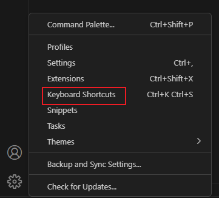

# 快捷键绑定

想要将一条命令绑定到某个快捷键，只需要修改 `package.json`

```json
{
	"contributes": {
      "commands": [
        {
          "command": "helloworld.helloWorld",
          "title": "Hello World"
        }
      ],
      "keybindings": [
        {
          "command": "helloworld.helloWorld",
          "key": "ctrl+f10",
          "mac": "cmd+f10",
          "when": "editorTextFocus"
        }
      ],
  }
}
```

上面将命令绑定在 `ctrl+F10` 上，并且当中间的编辑器聚焦的时候才生效。

在vscode左下角可以看到绑定的快捷键情况

