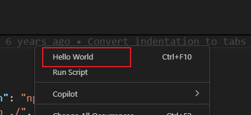

# 菜单绑定

在 `package.json` 的 `contributes.menus` 中可以将某个命令绑定在右键菜单中。

```json
{
  "contributes": {
    "commands": [
      {
        "command": "helloworld.helloWorld",
        "title": "Hello World"
      }
    ],
    "menus": {
      "editor/context": [
        {
          "when": "editorFocus",
          "command": "helloworld.helloWorld",
          "group": "navigation"
        }
      ]
    }
  }
}
```

上面例子将命令绑定在了编辑器区域的右键菜单中



## 菜单配置

vscode分为不同区域，各自都可以控制菜单。`contributes.menus` 下面可以配置多个不同位置的菜单。

* `editor/context`：中间代码编辑区域的右键菜单
* `editor/title`：中间代码编辑器区域右上角的菜单，不配置图片就展示文字，配了图片就展示图片
* `editor/title/context`：中间代码编辑器标题的右键菜单
* `explorer/context`：资源管理器右键菜单