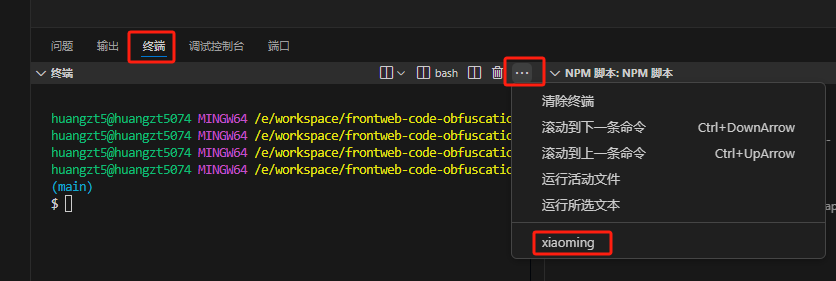
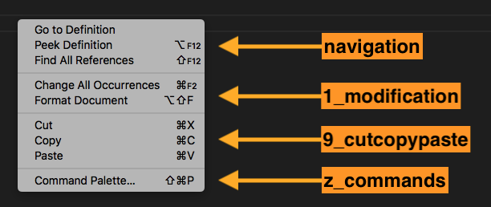

# 菜单绑定

在 `package.json` 的 `contributes.menus` 中可以将某个命令绑定在右键菜单中。

```json
{
  "contributes": {
    "commands": [
      {
        "command": "helloworld.helloWorld",
        "title": "Hello World"
      }
    ],
    "menus": {
      "editor/context": [
        {
          "when": "editorFocus",
          "command": "helloworld.helloWorld",
          "group": "navigation"
        }
      ]
    }
  }
}
```

上面例子将命令绑定在了编辑器区域的右键菜单中


## 菜单配置

vscode分为不同区域，各自都可以控制菜单。`contributes.menus` 下面可以配置多个不同位置的菜单。

* `editor/context`：中间代码编辑区域的右键菜单

```json
{
  "contributes": {
    "menus": {
      "editor/context": [{
        "command": "jd.getCurrentFilePath",
        "group": "navigation"
      }]
    }
  }
}
```


* `editor/title`：中间代码编辑器区域右上角的菜单，不配置图片就展示文字，配了图片就展示图片

```json
{
  "contributes": {
    "commands": [
      {
        "command": "jr.xiaoming",
        "title": "小明",
        "icon": {
            "light": "./images/tool-light.svg",
            "dark": "./images/tool-light.svg"
        }
      }
    ],
    "menus": {
      "editor/title": [
        {
          "command": "jr.xiaoming",
          "group": "navigation"
        }
      ]
    }
  }
}
```


* `editor/title/context`：中间代码编辑器tab标题的右键菜单

```json
{
  "contributes": {
    "menus": {
      "editor/title/context": [
        {
          "command": "jr.xiaoming",
          "group": "navigation"
        }
      ]
    }
  }
}
```


* `explorer/context`：左侧资源管理器的右键菜单

```json
{
  "contributes": {
    "menus": {
      "explorer/context": [{
        "command": "jd.getCurrentFilePath",
        "group": "navigation"
      }]
    }
  }
}
```


* `debug/callstack/context`：调试callstack视图上下文菜单
* `scm/title`：SCM标题菜单
* `scm/resourceGroup/context`：SCM资源组菜单
* `scm/resource/context`：SCM资源菜单
* `scm/change/title`：SCM更改标题菜单
* `view/title`：终端标题处的菜单

```ts
{
  "menus": {
    "view/title": [{
      "command": "extdev.xiaoming"
    }]
  }
}
```



* `view/item/context`：视图项菜单
* `commandPalette`：控制命令是否显示在命令选项板中
* `webview/context`：任何网页视图上下文菜单
* `例子`：例子

## 菜单的位置排序

### 1. editor/context 编辑区域菜单

中间代码编辑区域的菜单布局如下：

- `navigation`- 放在这个组的永远排在最前面；
- `1_modification` - 更改组；
- `9_cutcopypaste` - 编辑组
- `z_commands` - 最后一个默认组，其中包含用于打开命令选项板的条目。



除了`navigation`是强制放在最前面之外，其它分组都是按照0-9、a-z的顺序排列的，所以如果你想在`1_modification`和`9_cutcopypaste`插入一个新的组别的话，你可以定义一个诸如`6_test`

```json
{
  "contributes": {
    "menus": {
      "editor/context": {
        {
          "command": "jr.xiaoming",
          "group": "6_test"
        }
      }
    }
  }
}
```


### 2. explorer/context 资源管理区的菜单

资源管理区菜单布局如下：

- `navigation` - 放在这个组的永远排在最前面；
- `2_workspace` - 与工作空间操作相关的命令。
- `3_compare` - 与差异编辑器中的文件比较相关的命令。
- `4_search` - 与在搜索视图中搜索相关的命令。
- `5_cutcopypaste` - 与剪切，复制和粘贴文件相关的命令。
- `7_modification` - 与修改文件相关的命令。

在 `编辑器选项卡上下文菜单` 有这些布局

- `1_close` - 与关闭编辑器相关的命令。
- `3_preview` - 与固定编辑器相关的命令。

### 3. editor/title 编辑区头部菜单

菜单布局如下：

- `1_diff` - 与使用差异编辑器相关的命令。
- `3_open` - 与打开编辑器相关的命令。
- `5_close` - 与关闭编辑器相关的命令。

### 9. 同个组的排序

默认同一个组的顺序取决于菜单名称，如果想自定义排序的话可以再组后面通过`@<number>`的方式来自定义顺序，例如：

```json
{
  "contributes": {
    "menus": {
      "editor/context": [
          {
              "when": "editorFocus",
              "command": "extension.sayHello",
              // 强制放在navigation组的第2个
              "group": "navigation@2" 
          },
          {
              "when": "editorFocus",
              "command": "extension.demo.getCurrentFilePath",
              // 强制放在navigation组的第1个
              "group": "navigation@1"
          }
      ]
    }
  }
}
```

