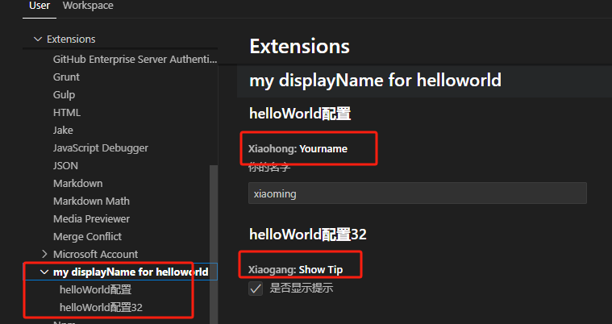

# 插件配置

在 `package.json` 中的 `contributes.configuration` 配置，这些配置项将可以在vscode的配置setting中去修改。


## 简单的配置

```json
{
  "contributes": {
    "configuration": [
      {
        "type": "object",
        "title": "helloWorld配置",
        "properties": {
          "xiaohong.yourname": {
            "type": "string",
            "default": "xiaoming",
            "description": "你的名字"
          },
          "xiaohong.yourage": {
            "type": "number",
            "default": 18,
            "description": "你的年龄"
          }
        }
      }
    ],
	}
}
```

当 `contributes.configuration` 数组（配置大类）中只有一项的时候，每一个配置大类下可以有多个配置小类，vscode的展示如下:


可以看出，左侧的标题取的是 `title` 的文案。配置项中的 `Xiaohong:Yourname` 取的是 `properties` 中的key。


而当配置大类有项目的时候

```json
{
  "name": "helloworld",
  "displayName": "my displayName for helloworld",
  "contributes": {
    "configuration": [
      {
        "type": "object",
        "title": "helloWorld配置",
        "properties": {
          "xiaohong.yourname": {
            "type": "string",
            "default": "xiaoming",
            "description": "你的名字"
          }
        }
      },
      {
        "type": "object",
        "title": "helloWorld配置32",
        "properties": {
          "xiaogang.showTip": {
            "type": "boolean",
            "default": true,
            "description": "是否显示提示"
          }
        }
      }
    ]
  }
}
```

左侧文案就会变成取 `displayName` 或 `name` 的，然后下拉再是每个配置大类的名称，而右侧就是每个配置小项



