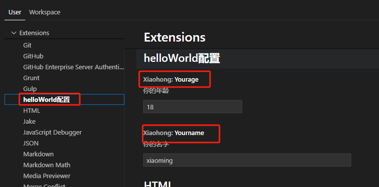
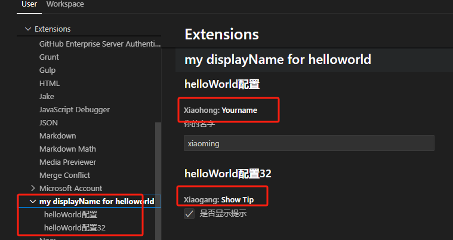
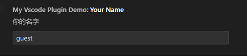
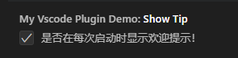
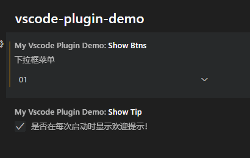

# 插件配置项

在 `package.json` 中的 `contributes.configuration` 配置，这些配置项将可以在vscode的配置setting中去修改。

```json
{
  "contributes": {
    "configuration": [
      {
        "type": "object",
        "title": "helloWorld配置", // 标题展示在配置左侧栏上
        "properties": {
          "xiaohong.yourname": {
            "type": "string",
            "default": "xiaoming", // 默认值
            "description": "你的名字"
          },
          "xiaohong.yourage": {
            "type": "number",
            "default": 18,
            "description": "你的年龄"
          }
        }
      }
    ],
	}
}
```

当 `contributes.configuration` 数组（配置大类）中只有一项的时候，每一个配置大类下可以有多个配置小类，vscode的展示如下:



可以看出，左侧的标题取的是 `title` 的文案。配置项中的 `Xiaohong:Yourname` 取的是 `properties` 中的key。

而当配置大类有多个的时候

```json
{
  "name": "helloworld",
  "displayName": "my displayName for helloworld",
  "contributes": {
    "configuration": [
      {
        "type": "object",
        "title": "helloWorld配置",
        "properties": {
          "xiaohong.yourname": {
            "type": "string",
            "default": "xiaoming",
            "description": "你的名字"
          }
        }
      },
      {
        "type": "object",
        "title": "helloWorld配置32",
        "properties": {
          "xiaogang.showTip": {
            "type": "boolean",
            "default": true,
            "description": "是否显示提示"
          }
        }
      }
    ]
  }
}
```

左侧文案就会变成取 `displayName` 或 `name` 的，然后下拉再是每个配置大类的名称，而右侧就是每个配置小项



## 配置类型

* 字符串

```json
{
  "myVscodePluginDemo.yourName": {
    "type": "string",
    "default": "guest",
    "description": "你的名字"
  }
}
```



* boolean

```json
{
  "myVscodePluginDemo.showTip": {
    "type": "boolean",
    "default": true,
    "description": "是否在每次启动时显示欢迎提示！"
  }
}
```



* 下拉框

```json
{
  "myVscodePluginDemo.showBtns": {
    "type": "string",
    "enum": ["01", "02", "03"],
    "enumDescriptions": ["数字", "小写字母", "大写字母"],
    "default": "01",
    "description": "下拉框菜单"
  }
}
```



* 

## 配置的读取和修改

通过 `vscode.workspace.getConfiguration()` 返回一个 `WorkspaceConfiguration` 对象，有下面的方法

```ts
export interface WorkspaceConfiguration {
    readonly [key: string]: any;

    has(section: string): boolean;
    get<T>(section: string): T | undefined;
    get<T>(section: string, defaultValue: T): T;
    update(section: string, value: any, /* 省略 */ ): Thenable<void>;
}
```

读取某个配置

```ts
const config = vscode.workspace.getConfiguration()
const result = config.get('xiaogang.showTip'); // 如果没有设置，返回undefined
```


修改某个配置

```ts
// 最后一个参数，为true时表示写入全局配置，为false或不传时则只写入工作区配置
vscode.workspace.getConfiguration().update('xiaohong.yourname', '前端艺术家', true);
```

修改配置的时候，第3个参数如果为`false`，则修改的是当前工作区的，会同步项目的`.vscode/settings.json`，但是vscode的设置面板中不会有影响。如果传的是`true`，则直接修改的是全局配置中的，vscode的设置面板中就看到新的。


监听配置改变，可以通过追加命令 `vscode.workspace.onDidChangeConfiguration`

```ts
const lastBookTitle = vscode.workspace.getConfiguration().get('vscode-extdev-book.bookTitle');

context.subscriptions.push(vscode.workspace.onDidChangeConfiguration(() => {
  const config = vscode.workspace.getConfiguration();
  const bookTitle = config.get('vscode-extdev-book.bookTitle');
  if(lastBookTitle != bookTitle) {
    vscode.window.showInformationMessage(`bookTitle changed: ${bookTitle}`);
    lastBookTitle = bookTitle;
  }
}));
```

