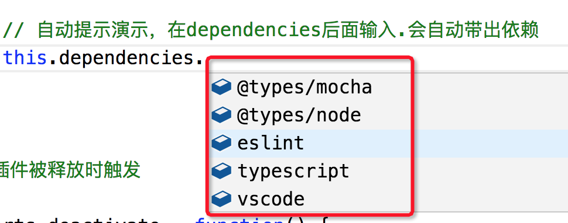
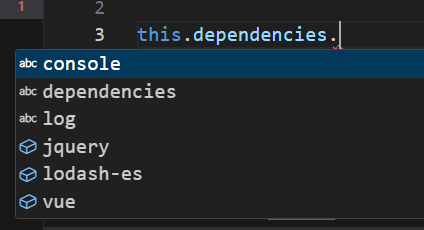

# 提示补全

## 简单的例子

通过 `vscode.languages.registerCompletionItemProvider()` 方法注册自动完成实现，该API接收3个参数

- 第一个是要关联的文件类型；
- 第二个是一个对象，里面必须包含`provideCompletionItems`和`resolveCompletionItem`这2个方法；
- 第三个是一个可选的触发提示的字符列表；

这里我们实现这样一个例子，当输入 `this.dependencies.xxx` 时自动把 `package.json` 中的依赖全部带出来，包括`dependencies`、`devDependencies`，就像这样：



```ts
export function activate(context: vscode.ExtensionContext) {
	context.subscriptions.push(
		vscode.languages.registerCompletionItemProvider('javascript', {
			provideCompletionItems(document, position, token, context) {
				const line = document.lineAt(position);
				const lineText = line.text.substring(0, position.character); // 只截取到光标位置为止，防止一些特殊情况
				// 简单匹配，只要当前光标前的字符串为`this.dependencies.`都自动带出所有的依赖
				if(/(^|=| )\w+\.dependencies\.$/g.test(lineText)) {
					return ['jquery', 'vue', 'lodash-es'].map(dep => {
						// vscode.CompletionItemKind 表示提示的类型，数字4
						return new vscode.CompletionItem(dep, vscode.CompletionItemKind.Field);
					})
				}
			},
			// 光标选中当前自动补全item时触发动作，一般情况下无需处理
			resolveCompletionItem(item, token) {
				console.info('---resolveCompletionItem--',item,token);
				return null;
			}
		}, '.')
	);
}
```

然后需要在 `package.json` 中`activationEvents` 激活

```json
{
  "activationEvents": [
    "onLanguage:javascript"
  ]
}
```

当我们在 js 文件中写代码，遇到 `this.dependencies.` 的时候，就会出现下面的选择项



如果在ts项目，将这个抽离出去封装成一个类 `MyCompletionItemProvider.ts` ，通过 `implements vscode.CompletionItemProvider` 得到更好的类型支持

```ts
import * as vscode from 'vscode';

// 代码提示
export class MyCompletionItemProvider implements vscode.CompletionItemProvider {
	provideCompletionItems(
		document: vscode.TextDocument, 
    position: vscode.Position, 
    token: vscode.CancellationToken, 
    context: vscode.CompletionContext): vscode.ProviderResult<vscode.CompletionItem[] | vscode.CompletionList<vscode.CompletionItem>> {
		// ...
	}
	resolveCompletionItem?(item: vscode.CompletionItem, token: vscode.CancellationToken): vscode.ProviderResult<vscode.CompletionItem> {
    // ...
	}
}
```

然后在 `extension.ts` 引用

```ts
import * as vscode from 'vscode';
import { MyCompletionItemProvider } from './MyCompletionItemProvider';

export function activate(context: vscode.ExtensionContext) {
	context.subscriptions.push(vscode.languages.registerCompletionItemProvider('javascript', new MyCompletionItemProvider));
}

```


