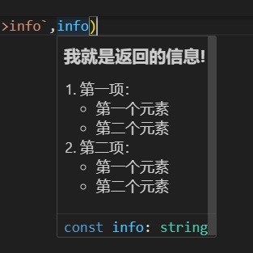
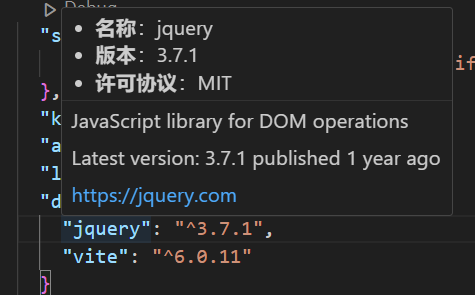

# 悬停提示

在vscode停在某个单词上，vscode默认就会帮我们预览一部分内容作为提示。

如果想获得更多的提示，我们还可以通过`vscode.languages.registerHoverProvider()`命令来实现。

* 第1个参数是指定哪些文件，比如设置`javascript`那么就只有js文件才有这个，如果是所有文件，可以使用 `*` 字符串

## 简单例子

以下是一个简单的例子

```ts
export function activate(context: vscode.ExtensionContext) {
  console.log('Congratulations, your extension "jrd" is now active!');
  context.subscriptions.push(
    vscode.languages.registerHoverProvider("javascript", {
			provideHover(document, position, token) {
				console.log('haha')
				return new vscode.Hover(
					`### 我就是返回的信息!
1. 第一项：
	- 第一个元素
	- 第二个元素
2. 第二项：
	- 第一个元素
	- 第二个元素`);
			}
		})
  );
}
```

然后需要在 `package.json` 激活下

```json
{
  "activationEvents": [
    "onLanguage:javascript"
  ]
}
```



`new vscode.Hover()` 支持markdown语法。

当有多个hover提示的时候，vscode会将其合并起来全展示出来


那么我们就想办法组装好hover的md内容即可，比如以下是一个悬浮然后展示node_modules中相关信息的实现

```ts
import { existsSync } from "fs";
import { dirname } from "path";
import * as vscode from "vscode";

export function activate(context: vscode.ExtensionContext) {
  context.subscriptions.push(
    vscode.languages.registerHoverProvider("json", {
      provideHover(document, position, token) {
        const fileName = document.fileName;
				console.log('fileName===>', fileName);
        const workDir = dirname(fileName);
        const word = document.getText(document.getWordRangeAtPosition(position));
        if (/package\.json$/.test(fileName)) {
          const json = document.getText();
          if (new RegExp(`"(dependencies|devDependencies)":\\s*?\\{[\\s\\S]*?${word.replace(/\//g,"\\/")}[\\s\\S]*?\\}`,"gm").test(json)) {
            let destPath = `${workDir}/node_modules/${word.replace(/"/g,"")}/package.json`;
            if (existsSync(destPath)) {
              const content = require(destPath);
              // hover内容支持markdown语法
              return new vscode.Hover(
                `* **名称**：${content.name}\n* **版本**：${content.version}\n* **许可协议**：${content.license}`
              );
            }
          }
        }
      },
    })
  );
}
```

实现效果如下：

