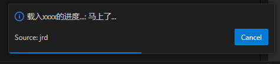

# 加载进度条

要展示加载的进度条，主要依赖 `vscode.window.withProgress()` 这个API。

```ts
vscode.commands.registerCommand("jrd.helloWorld", async () => {
  const result = await vscode.window.withProgress(
    {
      location: vscode.ProgressLocation.Notification, // 15这个值
      title: "载入xxxx的进度...",
      cancellable: true,
    },
    async (progress) => {
      // 初始化进度
      progress.report({ increment: 0 });
      await sleep(1000);
      progress.report({ increment: 10, message: "在努力。。。." });
      await sleep(1000);
      progress.report({ increment: 40, message: "马上了..." });
      await sleep(2000);
      progress.report({ increment: 50, message: "这就结束..." });
      await sleep(2000);
      return 'xiaoming';
    }
  );
  console.log(`output->result`,result); // 得到了 xiaoming
})
```

 `vscode.window.withProgress()` 的第1个参数是配置：

* `title` 加载框标题
* `cancellable` 是否可取消

调用 `progress.report()` 初始化进度，最终效果是在vscode的右下角有界面如下：



