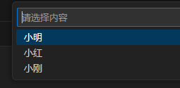
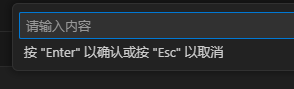
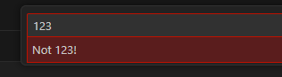
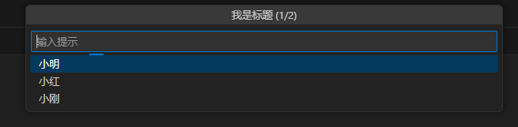
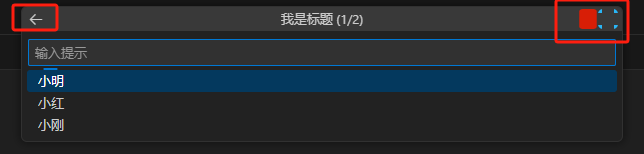
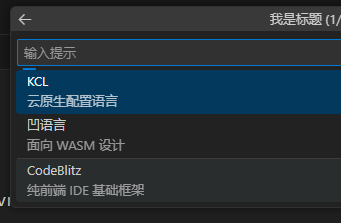

# 交互输入框

## 列表下拉框-showQuickPick

通过 `vscode.window.showQuickPick()` 实现，其ts类型如下：

```ts
function showQuickPick(
    items: readonly string[],
    options?: QuickPickOptions
): Thenable<string>;

interface QuickPickOptions {
    title?: string;
    placeHolder?: string;
    onDidSelectItem?(item: QuickPickItem | string): any; // 上下切换选项的时候触发
}
```

例如：

```ts
const result = await vscode.window.showQuickPick(
  ['小明', '小红', '小刚'],
  {
    placeHolder: '请选择内容',
    onDidSelectItem: item => {
      console.log('onDidSelectItem=>' + item);
    }
  }
);
```



## 普通输入框-showInputBox

通过 `vscode.window.showInputBox()` 这个实现，对应 ts类型：

```ts
function showInputBox(options?: InputBoxOptions): Thenable<string>;
interface InputBoxOptions {
  title?: string;
  value?: string;
  placeHolder?: string;
  password?: boolean;
  validateInput?(value: string): string;
  // 其他省略
}
```

例如：

```ts
const result = await vscode.window.showInputBox({
  value: '默认值',
  placeHolder: '请输入内容',
  validateInput: text => {
    vscode.window.showInformationMessage(`Validating: ${text}`);
    return text === '123' ? 'Not 123!' : null; // 当返回string的时候，验证不通过
  }
});
```



在`validateInput()` 中如果返回string类型，表示验证不通过，效果如下：



## 更定制的createQuickPick和createInputBox

前面的 `vscode.window.showQuickPick()` 和 `vscode.window.showInputBox()` 是vscode封装好的，简单使用但不够灵活。

如果追求更加灵活的场景，可以使用 `vscode.window.createQuickPick()` 和 `vscode.window.showInputBox()`

比如自定义下拉框

```ts
const quickPick = vscode.window.createQuickPick();
quickPick.items = ["小明", "小红", "小刚"].map((label) => ({ label }));
quickPick.title = "我是标题";
quickPick.placeholder = "输入提示";
quickPick.busy = true; // 出现一个loading的动画

quickPick.step = 1; // 第N个步骤（经常和其他选择器一起用表示后续步骤提示作用）
quickPick.totalSteps = 2; // 总步骤

quickPick.show(); // 展示下拉框
quickPick.onDidChangeSelection((selection) => {
  console.log(`onDidChangeSelection->`, selection);
});
quickPick.onDidAccept(() => {
  console.log(`onDidAccept->`, quickPick.value);
  quickPick.hide(); // 消失  
});
quickPick.onDidHide(() => {
  console.log(`onDidHide->`);
});
```



也可以定制按钮

```ts
const btnRedAdd = {
  iconPath: vscode.Uri.file(context.asAbsolutePath("svg/delete.svg")),
  tooltip: "红色图标",
};
const btnBlueAdd = {
  iconPath: vscode.Uri.file(context.asAbsolutePath("svg/add.svg")),
  tooltip: "蓝色图标",
};

quickPick.buttons = [
  vscode.QuickInputButtons.Back, // vscode的[返回]按钮
  btnRedAdd,
  btnBlueAdd,
];
```



选择项也可以进行更细致的控制

```ts
quickPick.items = [
  { label: "KCL", detail: "云原生配置语言" },
  { label: "凹语言", detail: "面向 WASM 设计" },
  { label: '', kind: vscode.QuickPickItemKind.Separator }, // 分隔符
  { label: "CodeBlitz", detail: "纯前端 IDE 基础框架" },
];
```




## 选择文件

让vscode选择文件，使用到 `vscode.window.showOpenDialog()` 这个API

```ts
vscode.window.showOpenDialog({
  canSelectFiles: false, // 是否可选文件
  canSelectFolders: true, // 是否可选文件夹
  canSelectMany: false, // 是否可以选择多个
  openLabel: "小明", // 选择文件窗口右下角的文案
}).then(function (res) {
  
});
```


