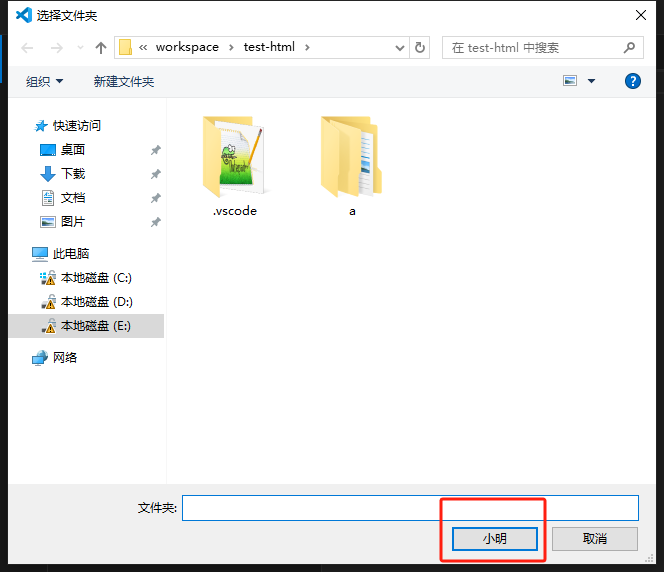

# 选择文件

让vscode选择文件，使用到 `vscode.window.showOpenDialog()` 这个API

```ts
vscode.window.showOpenDialog({
  canSelectFiles: false, // 是否可选文件
  canSelectFolders: true, // 是否可选文件夹
  canSelectMany: false, // 是否可以选择多个
  openLabel: "小明", // 选择文件窗口右下角的文案
}).then(function (res) {
  
});
```




