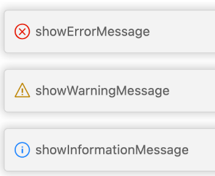
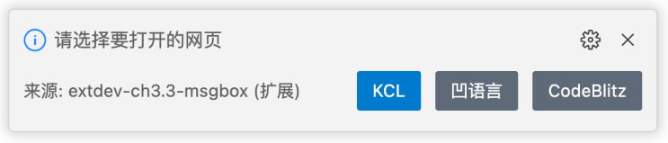
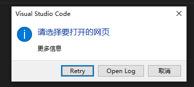

# window对象

`vscode.window` 里面各种跟视口有关的API

##  通知

`vscode.window.showInformationMessage()`：可以传递第2/3个参数，这样的弹窗就有按钮，可以通过下面方式获取用户点击了哪个按钮

```ts
const answer = await vscode.window.showInformationMessage('Hello World from VSTodo!', '确定', '取消');
console.log(answer); // 确定/取消
```

vscode提供 `showInformationMessage | showWarningMessage | showErrorMessage` 3种通知，效果如下：



这3个api的入参和返回都是一样。

```ts
vscode.window.showInformationMessage('小明');
```

接受多个字符串，从第2个参数开始回作为按钮展示

```ts
const result = await vscode.window.showInformationMessage('请选择要打开的网页', "KCL", "凹语言", "CodeBlitz"); // result是点击了哪个按钮
```



也能接受一个配置项，对应ts类型如下：

```ts
export interface MessageOptions {
    modal?: boolean;
    detail?: string;
}

export interface MessageItem {
    title: string;
    isCloseAffordance?: boolean;
}

function showInformationMessage(
    message: string, options: MessageOptions, ...items: MessageItem[]
): Thenable<MessageItem | undefined>;
```

比如，效果如下：

```ts
const result = await vscode.window.showInformationMessage(
  "请选择要打开的网页",
  { modal: true, detail: "更多信息" },
  { title: "Retry" },
  { title: "Open Log" }
)
```



## 状态栏 

可以通过 `vscode.window.setStatusBarMessage()` 设置loading状态，对应的ts类型

```ts
namespace windows {
    function setStatusBarMessage(text: string): Disposable;
    function setStatusBarMessage(text: string, hideAfterTimeout: number): Disposable;
}
```

比如下面代码和效果：

```ts
vscode.window.setStatusBarMessage('cmd: extdev.showMsgbox', 3000);
```

