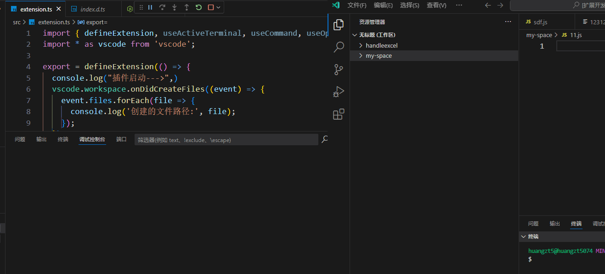

# workspace对象

`vscode.workspace` 提供的是当前工作区的一些对象

## 其他

**1. 监听创建文件**

`workspace.onDidCreateFiles()` 可以监听工作区的创建动作，如果有多个工作区也是监听到

```ts
const disposable = vscode.workspace.onDidCreateFiles((event) => {
  event.files.forEach(file => {
    console.log('创建的文件路径:', file);
  });
});
```



当扩展停用的时候，如果需要停止监听，可以使用下面写法：

```ts
context.subscriptions.push(disposable); // 当扩展停用时注销监听器（可选）
```

**2.打开文件**

```ts
// 比如我们要打开某个文件
const doc = await vscode.workspace.openTextDocument(join(__dirname, './myMdExample.md'));
vscode.window.showTextDocument(doc);
```

