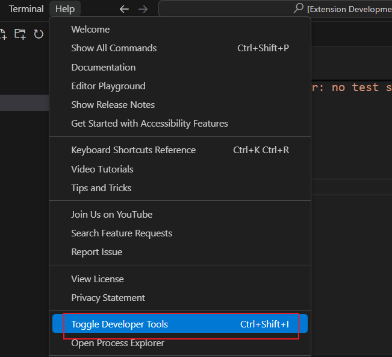
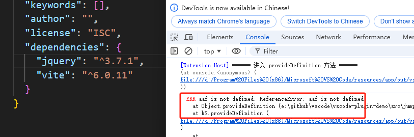

# 插件调试

启动调试之后，会新开一个vscode调试窗口（我们假设称为DevHost窗口），编写插件代码的窗口（我们假设称为源窗口）

## 源窗口的调试

源窗口的调试，主要依靠打断点的方式

## DevHost窗口的调试

这个窗口的调试，主要是看控制台的日志，唤起控制台的快捷键`Ctrl + Shift + I`，或者在vscode的 `Help -> Toggle Devloper Tools`。或者通过命令打开也行



有时候，我们的代码莫名没有生效，在源窗口的日志也没有报错，有些报错是不会显示在源窗口的出现。

如果你不知道到DevHost窗口的控制台来查看日志，就会一脸懵逼的到处乱试了。

源窗口的调试只打印常规日志，语法错误并不会显示在这里，而是要去DevHost窗口的控制台

比如 `自定义definition跳转` 下面代码

```ts
context.subscriptions.push(vscode.languages.registerDefinitionProvider(['json'], {
  provideDefinition(document, position, token) {
    console.log('====== 进入 provideDefinition 方法 ======');
    console.log(aaf); // 这里会报错
    console.log('继续---')
  }
}));
```

上面的报错，源窗口看不到报错信息，要在DevHost窗口的才看到



