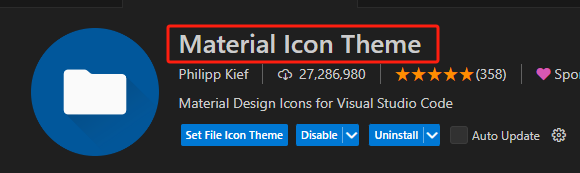
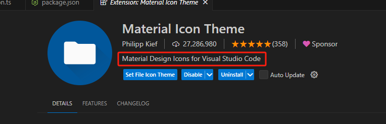
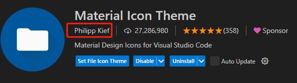
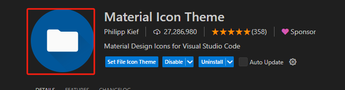

# package.json介绍

## 相对完整的package.json

整个 `package.json` 配置介绍可见[官网](https://code.visualstudio.com/api/references/extension-manifest)

```json

```


## 字段介绍

### name / displayName

会展示在插件的name属性，即下图位置，如果 `displayName` 没有定义就会取 `name`



`name`有比较严格的格式要求：不能有空格、只能小写。因为 `name` 有比较高的格式要求。因此才有 `displayName`，这个没什么格式要求

## description

`description`可以对插件进一步的进行描述，所写的文案将展示在下面位置



## keywords 和 categories

`keywords`是一个数组，最多5个关键词，所用文案主要用来在插件市场搜索用

`categories`是一个数组，只要用在插件市场分类的时候用到，[可选值](https://code.visualstudio.com/api/references/extension-manifest)：`[Programming Languages, Snippets, Linters, Themes, Debuggers, Formatters, Keymaps, SCM Providers, Other, Extension Packs, Language Packs, Data Science, Machine Learning, Visualization, Notebooks, Education, Testing]`

```json
{
  "keywords": ["vscode", "plugin", "demo"],
  "categories": ["Other"]
}
```

## publisher

`publisher`插件的发布者，该字段将展示在下面位置



## icon

png格式，要求至少 `128x128` 像素，将展示下面位置



## activationEvents 和 contributes

`activationEvents` 和 `contributes` 是整个vscode的核心。

### 1.activationEvents配置

支持一下配置：

\* `onLanguage:$`：

\* `onCommand:$`：

\* `onDebug`：

\* `workspaceContains:$`：

\* `onFileSystem:$`：

\* `onView:$`：

\* `onUri`：

\* `*`：所有都会在vscode启动的时候激活，但vscode不推荐配置成这个，需要什么才配置

### 2.contributes配置

`contributes` 支持下面配置，[官方文档](https://code.visualstudio.com/api/references/contribution-points)

* `contributes.configuration`：该插件能有哪些配置项，可以通过vscode的settings进行配置
* `contributes.commands`：命令信息
* `contributes.keybindings`：快捷键绑定
* `contributes.menus`：配置菜单
  * `editor/context`：中间代码编辑区域的右键菜单
  * `editor/title`：中间代码编辑器区域右上角的菜单，不配置图片就展示文字，配了图片就展示图片
  * `editor/title/context`：中间代码编辑器标题的右键菜单
  * `explorer/context`：资源管理器右键菜单
* `contributes.snippets`：代码片段
* `contributes.viewsContainers`：新的activitybar图标，也就是左侧侧边栏大的图标
* `contributes.views`：自定义侧边栏内view的实现
* `contributes.iconThemes`：图标主题
* `contributes.languages`：新语言支持
* `contributes.debuggers`：调试
* `contributes.breakpoints`：断点
* `contributes.grammars`：
* `contributes.themes`：主题
* `contributes.jsonValidation`：自定义JSON校验
* `contributes.problemMatchers`
* `contributes.problemPatterns`
* `contributes.taskDefinitions`
* `contributes.colors`

```json


```


