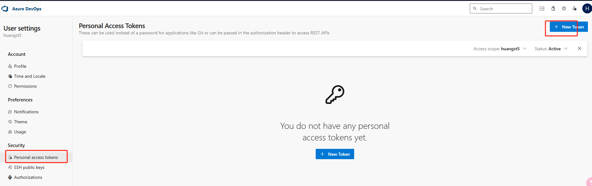
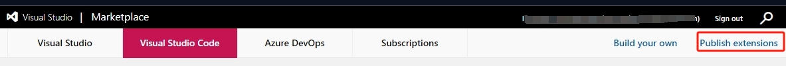
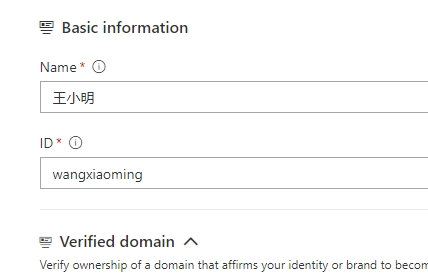

# 发布vscode插件

vscode插件发布市场，大概需要几个步骤

## 构建vsix后缀

1.安装打包的依赖 `npm install -g @vscode/vsce`。这是用来打包发布管理vscode插件的工具。

> 该插件依赖python3.6以上版本，需要提前安装python：https://www.python.org/downloads/windows/

2.修改 `package.json` 设置开发者和图标

```json
{
  "publisher": "wangxiaoming",
  "icon": "images/icon.png",
  "repository": "https://gitee.com/xxx/yyy",
}
```

新建 `LICENSE` 文件，根据需要写好内容。

3.执行 `vsce package` 打包，生成一个 `.vsix` 后缀名的文件。

如果项目使用的pnpm管理，会遇到下面问题，很多报错信息。如果使用npm就不会这个问题，这是是vsce还不兼容pnpm的问题导致。

```text
npm ERR! missing: es5-shim@^4.6.7, required by is-set@2.0.3
npm ERR! missing: es6-shim@^0.35.8, required by is-set@2.0.3
npm ERR! missing: in-publish@^2.0.1, required by is-set@2.0.3
npm ERR! missing: nyc@^10.3.2, required by is-set@2.0.3
npm ERR! missing: safe-publish-latest@^2.0.0, required by is-set@2.0.3
...
```


如果一定要使用pnpm，则可以在 `package.json` 新增下面的脚本，通过这2个脚本去构建

```json
{
  "scripts": {
    "vsce:package": "pnpm vsce package --no-dependencies",
    "vsce:publish": "pnpm vsce publish --no-dependencies"
  }
}
```

执行 `pnpm vsce:package`，会自动执行前置脚本的 `pnpm vscode:prepublish`

> 出于安全考虑，`vsce` 不会发布包含用户提供 SVG 图片的插件
>
> - `pacakge.json`文件中的 icon 不可以是 SVG。
> - `pacakge.json`中的徽章不可以是 SVG，除非来自于[可靠的图标来源](https://rackar.github.io/vscode-ext-doccn/extensibility-reference/extension-manifest.html#使用认证过的标志)
> - `README.md`和`CHANGELOG.md`中的图片链接需要使用`https`协议
> - `README.md`和`CHANGELOG.md`中的图片不可以是 SVG，除非来自[可靠的图标来源](https://rackar.github.io/vscode-ext-doccn/extensibility-reference/extension-manifest.html#使用认证过的标志)

## 不发布直接使用vsix

有了 vsix 文件之后，我们可以选择不发布，直接发给用户，用户通过下面方式安装


选择刚才生成好的 vsix 文件即可。

## 发布商城

Visual Studio Code的应用市场基于微软自己的`Azure DevOps`，插件的身份验证、托管和管理都是在这里。

- 要发布到应用市场首先得有应用市场的`publisher`账号；
- 而要有发布账号首先得有`Azure DevOps`组织；
- 而创建组织之前，首先得创建`Azure`账号；
- 创建`Azure`账号首先得有`Microsoft`账号；

1. 注册Microsoft账号

前往 [https://login.live.com/](https://login.live.com/) 用邮箱注册一个Microsoft账号


2. 创建 `Azure 的 Token`

前往 [https://aka.ms/SignupAzureDevOps](https://aka.ms/SignupAzureDevOps) 注册一个Azure账号，注册成功后会让你创建一个组织和项目，项目随便写下即可。

之后会到了这个界面，点击右上角的 `Profile`


然后选择 `Personal access tokens`，再选择 `New Token`



然后填写信息


下一步之后，可以看到下面的界面，界面上有token密钥，要找个地方记录下来，以后再也看不到


4.登录[vscode商城](https://marketplace.visualstudio.com/)。选择【Publish extensions】



填写一些个人信息比如姓名、id、头像等等



5.执行 `vsce publish` 发布（还没验证）