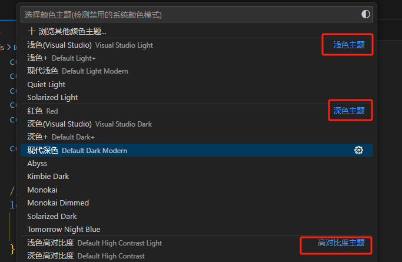

# rv主题

使用 `useIsDarkTheme()` 可以监听主题色切换，判断那个主题色是否是深色

```ts
const isDark = useIsDarkTheme()
watchEffect(() => {
  logger.info('Is Dark Theme:', isDark.value)
})
```

使用 `useActiveColorTheme()` 也可以得到当前的主题的类型

```ts
const theme = useActiveColorTheme(); // 返回的是一个 ref

watchEffect(() => {
  console.log(theme.value); // {kind:2}
})
```

下面是 kind 的含义

- `kind=1`：浅色主题，对应vscode常量的 `ColorThemeKind.Light`
- `kind=2`：深色主题，对应vscode常量的 `ColorThemeKind.Dark`
- `kind=3`：高对比度主题，对应vscode常量的 `ColorThemeKind.HighContrast`

