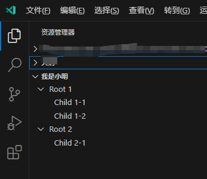

# rv的treeView视图

使用reactive-vscode展示treeView视图，需要这么操作，比如我们想要在【资源管理器】新增一个treeView视图，可以这么操作

修改 `package.json` 

```json
{
  "contributes": {
    "views": {
      "explorer": [
        {
          "id": "package-dependencies",
          "name": "我的tree视图"
        }
      ]
    }
  }
}
```

然后在代码中使用 `useTreeView(<命令ID>, <treeData数据>, <配置>)` 这个API进行注册

```ts
const treeData = ref<any[]>([]);
  useTreeView(
    'package-dependencies',
    treeData,
    {
      title: () => '我是小明',
    },
  )

  // 用setTimeout模拟异常操作
  setTimeout(() => {
    treeData.value = [
      {
        treeItem: {
          label: `Root 1`,
          collapsibleState: TreeItemCollapsibleState.Expanded,
        },
        children: [
          {
            treeItem: {
              label: `Child 1-1`,
              collapsibleState: TreeItemCollapsibleState.None,
            },
          },
          {
            treeItem: {
              label: `Child 1-2`,
              collapsibleState: TreeItemCollapsibleState.None,
            },
          }
        ]
      },
      {
        treeItem: {
          label: `Root 2`,
          collapsibleState: TreeItemCollapsibleState.Expanded,
        },
        children: [
          {
            treeItem: {
              label: `Child 2-1`,
              collapsibleState: TreeItemCollapsibleState.None,
            },
          }
        ]
      }
    ];
  }, 1000);
```

效果如下：



 `useTreeView(<命令ID>, <treeData数据>, <配置>)` ：

- treeData数据，可以直接是一个 `ref` 或者一个 `computed`，最终存入的数据结构满足下面条件即可
  - `treeItem`：每一行tree的数据，其中`treeItem.label`会作为标题展示在界面上。可以直接是一个对象，或者一个返回符合格式的Promise。
  - `children`：子tree数据，符合 `treeItem` 的结构