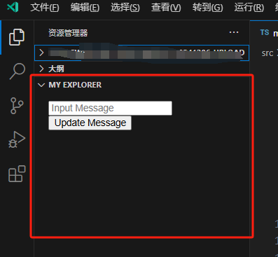

## rv的webView视图

在 reactive-vscode 中要创建webview视图，和treeView视图的类似

首先在 `package.json` 中明确声明这是一个 `{ "type": "webview" }` 类型

```json
{
  "contributes": {
    "views": {
      "explorer": [
        {
          "id": "my-extenion.explorer",
          "name": "My Explorer",
          "type": "webview" // 需要加上这个明确告诉vscode这是一个webview
        }
      ]
    }
  }
}
```

然后使用 `useWebviewView(<id>, <html字符串>, <配置>)` 创建webview视图

```ts
import * as vscode from 'vscode';
import { computed, ref, useWebviewView } from 'reactive-vscode';

export function activate(context: vscode.ExtensionContext) {
  const message = ref('')
  const html = computed(() => `
  <script>
    vscode = acquireVsCodeApi()
    function updateMessage() {
      vscode.postMessage({
        type: 'updateMessage',
        message: document.querySelector('input').value,
      })
    }
  </script>
  <p>${message.value}</p>
  <div style="display:flex; flex-wrap:wrap;">
    <input type="text" placeholder="Input Message" />
    <button onclick="updateMessage()">Update Message</button>
  </div>
  `)
  
  const { postMessage } = useWebviewView(
    'my-extenion.explorer',
    html,
    {
      webviewOptions: {
        enableScripts: true,
        enableCommandUris: true,
      },
      onDidReceiveMessage(ev) {
        if (ev.type === 'updateMessage')
          message.value = ev.message
      },
    },
  )
}


```

效果如下：



webview内和vscode通过 `onDidReceiveMessage` 进行通讯