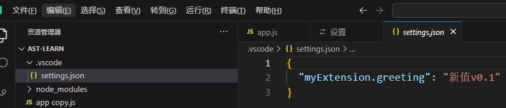

# rv的配置项

在 reactive-vscode 中设置和获取vscode配置，是很简单的事。

首先在`package.json` 中先声明好配置项目

```json
{
  "contributes": {
    "configuration": [
      {
        "title": "My Extension",
        "properties": {
          // 要符合 `配置id.配置`
          "myExtension.enable": {
            "type": "boolean",
            "default": true,
            "description": "启用 My Extension"
          },
          "myExtension.greeting": {
            "type": ["string", "null"],
            "default": "Hello!",
            "description": "问候消息。设置为 null 以禁用"
          }
        }
      }
    ]
  }
}
```

## defineConfigs

在代码中，我们可以通过 `defineConfigs(<配置id>)` 来获取

```ts
const { enable, greeting } = defineConfigs('myExtension', {
  enable: Boolean,
  greeting: [String, null],
});
console.log('获取值===》', enable.value, greeting.value);

useCommand('my-hello', () => {
  greeting.value = '新值v0.1'; // 这种方式修改存在工作区
})
```

- 通过 `.value` 获取配置项的值

- 通过设置 `.value` 可以修改配置，这种方式的修改只会存在工作区，即会在项目 `.vscode/settings.json`



- 如果要传递更多配置，可以使用 `update(<新值>, <配置>)` 

```ts
greeting.update('新增v0.2', ConfigurationTarget.Global); // 设置到全局配置生效
```

这种会全局生效。

- 如果只是仅仅想改变 js 运行的值，不想影响工作区和用户配置的话，可以用 `set(<新值>)`

```ts
greeting.set('新增v0.3');
greeting.value; // 新增v0.3
```

## defineConfigObject

同样是上面的配置，我们通过 `defineConfigObject('配置id')` 获取某个配置的对象

```ts
import { defineConfigObject } from 'reactive-vscode'

const config = defineConfigObject('your-extension', {
  enable: Boolean,
  greeting: [String, null],
});

config.greeting; // 获取值
config.greeting = '新值0.1'; // 设置到工作区
config.$update('greeting', '新值0.2', ConfigurationTarget.Global); // 要传递其余选项，你可以使用 `$update` 方法
config.$set('greeting', '新值0.3') // 只设置 js 运行的值而不写回配置
```


