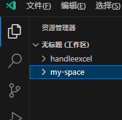

# rv的工作区

通过 `useWorkspaceFolders()` 可以获取当前工作区的项目信息

```ts
import { defineExtension, useWorkspaceFolders, watchEffect } from 'reactive-vscode'

export = defineExtension(() => {
  const workspaceFolders = useWorkspaceFolders()
  console.log("workspaceFolders.value--->", workspaceFolders.value); 是一个数组
})
```

上面的 `workspaceFolders.value` 是一个数组，每一项如下：

- `index`：索引，从0开始
- `name`：项目文件夹名
- `uri`：是vscode的uri对象



像上图工作区里面有2个项目，`workspaceFolders.value` 数组长度就有2个。