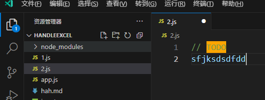

# rv的工具类

- `useAbsolutePath(<路径>)`：拼接出某个资源的绝对路径，返回的是一个 `ref` 对象

```ts
import { useAbsolutePath } from 'reactive-vscode';
useAbsolutePath('./demo.png').value; //  e:\workspace\my-reactive-vscode-extenion\demo.png
```

- `createSingletonComposable(<处理函数>)`：是一个用于创建单例组合式的辅助函数。它只会创建一次组合式，并在每次调用时返回相同的实例。

```ts
const say = createSingletonComposable(() => {
  console.log("say被调用") // 就算多次调用，这里打印1次
  return 'xiaoming'; // 需要有返回值
})

say()
say()
```

## 监听文件变化

使用 `useFsWatcher()` 可以监听指定文件的变化，支持 `glob` 模式

```ts
const filesToWatch = computed(() => ['**/*.md', '**/*.txt'])
const watcher = useFsWatcher(filesToWatch)
watcher.onDidChange((uri) => { // 监听的文件发生改变，就会触发
  console.log('File changed:', uri)
})
```

### document文档类

##### 1.`useDocumentText()` 函数

对应原生的方法 `TextDocument.getText()`，获取文档内容，返回的是一个`ref`

比如原生代码如下：

```ts
const edit = new vscode.WorkspaceEdit();
const lineNumber = editor.selection.active.line;
// 获取当前行上下文
const range = new vscode.Range(
  new vscode.Position(Math.max(0, lineNumber - 3), 0), // 前3行
  new vscode.Position(lineNumber + 3, 1000)           // 后3行
);
document.getText(range);
```

转为reactive-vscode如下：

```ts
const editor = vscode.window.activeTextEditor;
const selection = editor.selection;
const result = useDocumentText(editor.document);
result.value // result是一个ref
```

> 目前没发现可以传入范围的地方，只能获取整个文档内容？

### editor类

##### 1.`useActiveTextEditor()`

是 `window.activeTextEditor` 的响应式hook

原代码如下：

```ts
const editor = vscode.window.activeTextEditor;
if (!editor) { return; }
const edit = new vscode.WorkspaceEdit();
const lineNumber = editor.selection.active.line;
// 获取当前行上下文
const range = new vscode.Range(
  new vscode.Position(Math.max(0, lineNumber - 3), 0), // 前3行
  new vscode.Position(lineNumber + 3, 1000)           // 后3行
);
editor.document.getText(range);
```

改为 `useActiveTextEditor()` 代码如下：

```ts
const editor = useActiveTextEditor();
if (!editor.value) { return; }
// ...
```

##### 2. `useActiveEditorDecorations()`

比如现在想要将当前文件中的 `TODO` 高亮起来，那么可以这么写

```ts
const config = ref({
  keyword: 'TODO',
  color: '#FFA500'
})

useActiveEditorDecorations(
  { backgroundColor: config.value.color },
  () => {
    const editor = vscode.window.activeTextEditor
    if (!editor) return []

    const text = editor.document.getText()
    const ranges = []

    // 查找所有 TODO 的位置
    const regex = new RegExp(config.value.keyword, 'g')
    let match
    while ((match = regex.exec(text))) {
      const startPos = editor.document.positionAt(match.index)
      const endPos = editor.document.positionAt(match.index + match[0].length)
      ranges.push(new vscode.Range(startPos, endPos))
    }

    return ranges
  },
)
```

效果如下：

