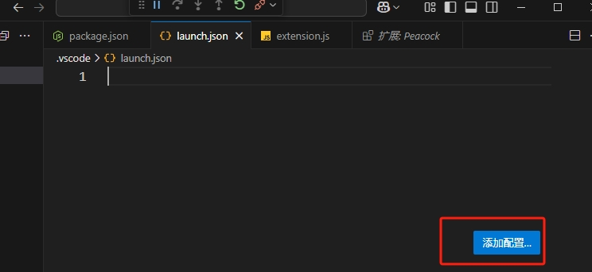
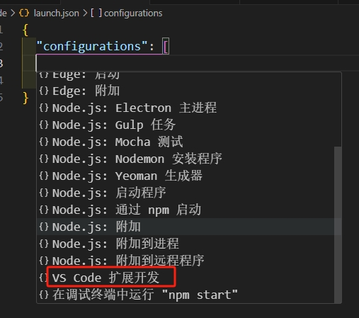
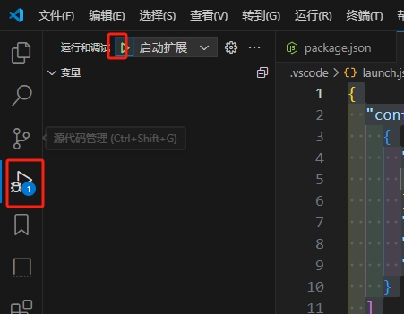
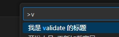

# 第1个vscode插件

这里介绍如何纯手动创建一个插件，平时推荐使用官方说的 `yoman` 进行创建更加。

## 手工创建

1.首先创建 `package.json` 填写基本信息

```json
{
  "name": "hello-vscode",
  "version": "0.0.1",
  "engines": {
    "vscode": "^1.80.0"     // 指定vscode版本
  },
  "main": "./extension.js"  // 指定入口
}
```

2.创建 `extension.js` 内容如下：

```js
const vscode = require('vscode');

// 参数：context vscode的上下文
function activate (context) {
  // vscode.commands.registerCommand接收2个参数，第1个参数是字符串，这个命令的名称，第2个参数一个一个回调函数
  const command = vscode.commands.registerCommand('validate', () => { 
    vscode.window.showInformationMessage('it works')
  })

  // context.subscriptions ==> vscode所有命令的注册列表，向这个列表push一个新命令即注册一个新命令
  context.subscriptions.push(command)
}

module.exports = {
  activate
}
```

除了代码上的，还需要在 `package.json` 声明好使用到的命令

```json
{
  "contributes": {
    "commands": [
      {
        "command": "validate",
        "title": "我是 validate 的标题"
      }
    ]
  }
}
```

这样vscode才能识别

3.创建调试工具，新建 `.vscode/launch.json`。点击右下角的【添加配置】



会出现很多类型让你选择， 这里选择【vscode插件调试】



选择之后，vscode会在 `launch.json` 添加下面配置

```json
{
  "configurations": [
    {
      "args": [
        "--extensionDevelopmentPath=${workspaceFolder}"
      ],
      "name": "启动扩展",
      "outFiles": [
        "${workspaceFolder}/out/**/*.js"
      ],
      "preLaunchTask": "npm",
      "request": "launch",
      "type": "extensionHost"
    }
  ]
}
```

上面这个配置是给那种ts项目的，我们是纯js项目，因此里面有些可以删除，最后改为下面的

```json
{
  "configurations": [
    {
      "args": [
        "--extensionDevelopmentPath=${workspaceFolder}"
      ],
      "name": "启动扩展",
      "request": "launch",
      "type": "extensionHost"
    }
  ]
}
```

接着去vscode的调试启动debug模式，或者按下 `F5` 键盘



vscode将会启动一个新的窗口，我们按着 `ctrl + alt + p` 既可以输入我们的命令验证效果



## 脚手架创建

这个也是官方推荐的一种方式


## 发布

