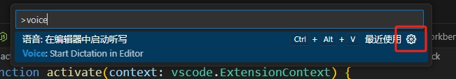
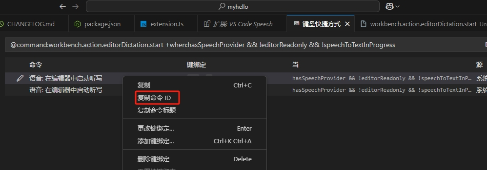
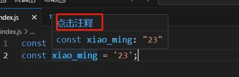

# 命令

基本开发vscode就是在开发各种各样的命令

## 注册命令

通过 `vscode.commands.registerCommand(<命令ID>, <回调函数>)` 可以在vscode注册一条命令，当用户选择命令的时候，就会执行对应的回调事件。

```typescript
import * as vscode from 'vscode';

export function activate(context: vscode.ExtensionContext) {
  const command = vscode.commands.registerCommand('myExtension.sayHello', () => {
    console.log(`Hello World!!!`);
  });
  context.subscriptions.push(command);
}
```

`vscode.commands.registerCommand`仅仅是将 命令id 绑定到了处理函数上

如果想让用户从命令面板中找到你的命令，还需要在 `package.json`中配置`contribution`

```json
{
  "contributes": {
    "commands": [
      {
        "command": "myExtension.sayHello",
        "title": "Say Hello"
      }
    ]
  }
}
```

## 执行其他命令

通过 `await vscode.commands.executeCommand(<命令ID>)` 可以让我们在自己的代码中执行某条命令。

比如vscode安装了 [VS Code Speech](https://marketplace.visualstudio.com/items?itemName=ms-vscode.vscode-speech) 之后，就可以调用语音输入的能力，而我们在自己的项目中也想调用，就需要先知道这个的命令id

则可以这么查看，在vscode按照 `ctrl + alt + p` 唤起面板，输入 `voice` 后找到右上角的设置按钮



进入下面面板后，选择对应的命令，然后右键，选择【复制命令】即可



比如上面复制之后得到了 `workbench.action.editorDictation.start`。那么我们只需要执行下面代码就可以唤起语音输入的能力

```js
await vscode.commands.executeCommand('workbench.action.editorDictation.start')
```

如果需要给命令传递参数，可以在第2个、第3个参数传递，例如下面传递

```ts
const activeEditor = vscode.window.activeTextEditor;
const definitions = await vscode.commands.executeCommand<vscode.Location[]>(
  'vscode.executeDefinitionProvider',
  activeEditor.document.uri,    // 参数1
  activeEditor.selection.active // 参数2
);
console.log(definitions);
```

## 命令的URI

命令的URI，通过 `vscode.Uri.parse('command:<命令ID>')` 获取到该命令的URI，有了这个URI，就可以放在webview、悬停文本上等场景上。

当用户点击URI的时候，就会执行对应的命令。

```ts
import * as vscode from "vscode";

export function activate(context: vscode.ExtensionContext) {
  const hoverProvider = vscode.languages.registerHoverProvider(
    "javascript",
    new (class implements vscode.HoverProvider {
      provideHover(
        _document: vscode.TextDocument,
        _position: vscode.Position,
        _token: vscode.CancellationToken
      ): vscode.ProviderResult<vscode.Hover> {
        const commentCommandUri = vscode.Uri.parse('command:editor.action.addCommentLine');
        const contents = new vscode.MarkdownString(`[点击注释](${commentCommandUri})`); // 里面是一个markown内容

        // command URIs如果想在Markdown 内容中生效, 你必须设置`isTrusted`。
        // 当创建可信的Markdown 字符, 请合理地清理所有的输入内容
        // 以便你期望的命令command URIs生效
        contents.isTrusted = true;
        return new vscode.Hover(contents);
      }
    })()
  );
  context.subscriptions.push(hoverProvider);
}
```

上面效果，当在js文件中，鼠标移入单词的时候，就会出现悬浮窗口，效果如下：



点击【点击注释】就可以执行 `editor.action.addCommentLine` 命令。

上面的写法，只有当插件被调用了才会生效，如果我们想要让其自动生效，可以修改 `package.json` 如下：

```json
{
  "activationEvents": [
    "onLanguage:javascript"
  ]
}
```

在URI中，如果需要给命令传递参数，比如下面代码中，给命令 `git.stage` 传递参数：

```typescript
import * as vscode from 'vscode';

export function activate(context: vscode.ExtensionContext) {
	vscode.languages.registerHoverProvider(
		'javascript',
		new class implements vscode.HoverProvider {
			provideHover(
				document: vscode.TextDocument,
				_position: vscode.Position,
				_token: vscode.CancellationToken
			): vscode.ProviderResult<vscode.Hover> {
    		// 用JSON数组的方式，然后转为 `encodeURIComponent(JSON.stringify(args))` 格式
				const args = [{ resourceUri: document.uri }]; 
				const commentCommandUri = vscode.Uri.parse(
					`command:git.stage?${encodeURIComponent(JSON.stringify(args))}`
				);
				const contents = new vscode.MarkdownString(`[添加暂存区](${commentCommandUri})`);
				contents.isTrusted = true;
				return new vscode.Hover(contents);
			}
		}()
	);
}
```

## 控制命令面板出现条件

默认情况下，我们注册的命令，都会在命名面板（`Ctrl + Shift + P`）里面出现。

但有时候，我们默认不想要出现，而是等到某种条件满足后才出现，就可以这么配置 `pakcage.json`

```json
{
  "contributes": {
    "commands": [
      {
        "command": "myExtension.sayHello",
        "title": "myExtension.sayHello"
      }
    ],
    "menus": {
			"commandPalette": [
        {
					"command": "myExtension.sayHello",
					"when": "editorLangId == markdown"
				}
      ]
    }
  }
}
```

比如上面配置，只有当打开的md文件的时候，再按 `ctrl + shift + p` 的时候，才能搜索到 `myExtension.sayHello` 这个命令。

## 命令配置
在 `contributes.configuration` 可以为命令添加对应的配置，通过 `workspace.getConfiguration` 可以获取用户的配置信息

## 快捷键
通过 `contributes.keybindings` 可以设置命令的快捷键

## 右键菜单
通过 `contributes.menus` 可以设置命令的右键菜单

