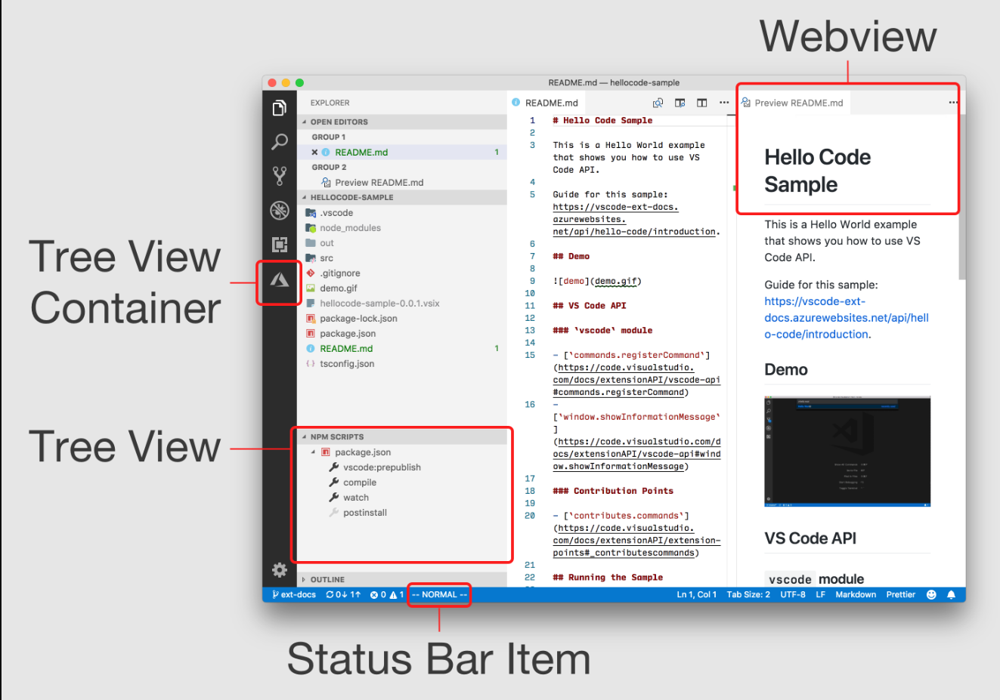

# Workbench工作台

vscode将界面分为下面几个区域

* Views Container：使用 `contributes.viewsContainers` 贡献点
* Tree View：使用 `contributes.views` 贡献点，更多可见[文档](https://code.visualstudio.com/api/extension-guides/tree-view)
* Webviews：是基于 HTML/CSS/JavaScript 构建的高度可自定义视图，在 Editor Group 区域的文本编辑器旁边显示
* Status Bar Item：状态栏项可以显示文本和图标，并在点击事件时运行命令。