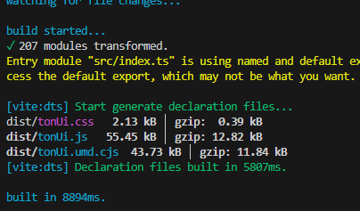

# 202501

* [rimraf](https://www.npmjs.com/package/rimraf)：可以方便删除node_modules，特别是pnpm workspace项目，可以配置下面的命令，方便删除所有node_modules和dist

```json
{
  "clear": "npx rimraf --glob ./node_modules ./packages/**/node_modules ./packages/**/dist"
}
```

推荐安装在全局中，避免执行一半所需要的node_modules已经被删了

* vue-router获取当前路由的信息：获取当前路由的信息，包括父级路由都会返回

```ts
const route = useRoute();
console.log(route.matched); // 返回一个数组
```

* npm脚本如下，一个脚本是用来build我们的UI库的，然后一个是用来启动业务项目的

```json
{
  "build:ui": "vite build --watch",
  "dev": "vite"
}
```

现在想要处理这么个场景，我们一般都是要UI库先打包好，再启动项目，所以2个合并起来，按照以往我们会用 `&&` 合并

```json
{
  "server": "pnpm run build:ui && pnpm run dev"
}
```

但这里有一个问题，因为我们的 `build:ui` 中使用了watch，进程会一直存在，导致执行不到 `&&` 后面的命令



那有没有什么方法，我们从上图可以看到执行完 `pnpm run build:ui` 之后，命令行一直停留在上面图中，那么那我们可以通过监听控制台是否出现 `build in`这个字眼，但出现的时候说明第1个命令已经执行好了，因此可以通过node脚本自己编写

```ts
import { exec } from 'node:child_process';

// 封装一个方法，用来执行命令，并监听控制台的信息输出
function shellExec(cmd: string, callback?: (data) => void) {
  const ls = exec(cmd);
  ls.stdout?.on('data', (data) => {
    callback && callback(data);
  });
}

let firstUIBuild = true;
shellExec('pnpm run build:ui', (msg: string) => {
  if (!firstUIBuild)
    return; // 如果不是第一次构建，则不执行
  if (msg.startsWith('\u001B[36mbuilt in') || msg.startsWith('built in')) {
    firstUIBuild = false;
    shellExec('pnpm run dev');
  }
});
```

需要注意的是，在window上，cmd看到的虽然是 `build in` 但实际上有个 `\u001B[36m` 开头的符号，所以判断需要改下成 `msg.startsWith('\u001B[36mbuilt in') || msg.startsWith('built in')`

加 `firstUIBuild` 的作用是，因为我们是watch模式，每次修改 ui 的代码，就会触发watch执行构建，构建之后又出现 `build in` 的信息，但是这个时候我们不需要启动 `pnpm run dev` 服务了，所以加个判断


