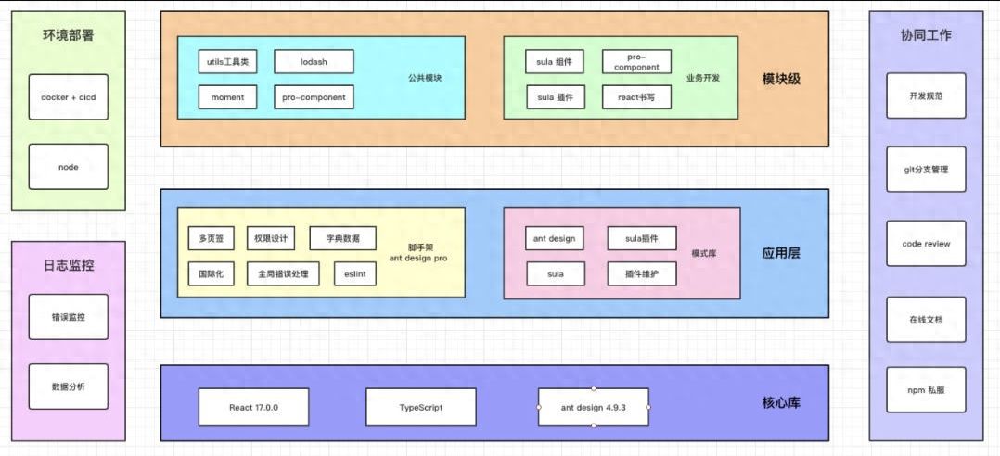

# 202504

- [npx node-modules-inspector](https://mp.weixin.qq.com/s/_eA4hbaKv2mN6xRLeSsBoQ)：antfu打造的神器，将node_modules可视化
- [Vue3 做主题色切换，一定要用这个神库！](https://www.toutiao.com/article/7482044177954505256/?log_from=6f6bacf61bce88_1744796828745)
- [前端工程化](https://www.toutiao.com/article/7307613068170101260)：介绍了一个项目的各个组成部分

- Gitee的 API 集合：[官网](https://gitee.com/api/v5/swagger#/getV5ReposOwnerRepoStargazers?ex=no)
- 飞叶开发了几个chrome插件
  - [embed-page-extension](https://kkgithub.com/cunzaizhuyi/embed-page-extension)：让页面可以直接展示在其他页面上，不用来回切换tab，[B站演示视频](https://www.bilibili.com/video/BV1gNx7e9EKZ/?spm_id_from=333.1387.upload.video_card.click)。
  - 在[另外个视频](https://www.bilibili.com/video/BV1eEpae8Ev1/) 作者介绍了另外一个[插件](https://kkgithub.com/cunzaizhuyi/up-mode-extension)：点击会自动屏蔽chrome的插件面板
  - [视频](https://www.bilibili.com/video/BV1hrpMe4E6x/) 介绍了另外一个 [插件](https://kkgithub.com/cunzaizhuyi/open-new-tab-extension)：可以控制某些页面点击 `<a />` 标签是新tab打开
  - [视频](https://www.bilibili.com/video/BV1cenoezENp) 介绍了一个 vscode插件，[bi-convert-import](https://kkgithub.com/cunzaizhuyi/bi-convert-import)：可以右键将cjs的引入改为es的引入
- 工具推荐，轻巧便捷，可以搜索到window上任何资源：[Everything](https://www.voidtools.com/zh-cn/downloads/)
- 大文件分片下载：[StreamSaver.js](https://www.toutiao.com/article/7297619589423284751)
- 工具推荐，可以看开源项目的架构：[gitdiagram](https://gitdiagram.com/)，比如输入vue的地址 `https://github.com/vuejs/core` 得到下面的架构图

- vue的挑战平台：[vuejs-challenges](https://cn-vuejs-challenges.netlify.app/challenges.html#category=Built-ins)

