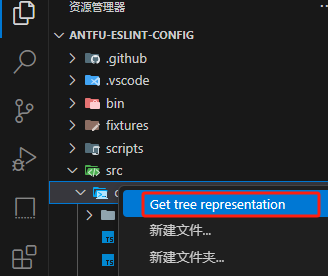
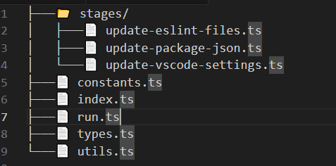

# 开源项目

## 公司维度

### 腾讯开源

- markdown编辑器：[cherry-markdown](https://kkgithub.com/Tencent/cherry-markdown/blob/dev/README.CN.md)
- 页面可视化平台：[tmagic-editor](https://tencent.github.io/tmagic-editor/docs/)

### 阿里开源

- 移动端UI库，React的：[Ant Design Mobile](https://mobile.ant.design/zh/)
- 低代码平台：[lowcode-engine](https://lowcode-engine.cn/site/docs/guide/quickStart/intro)

### 滴滴

- 绘画flow流程图：[logic-flow](https://07.logic-flow.cn/)

### 百度

- 低代码框架：[amis](https://aisuda.bce.baidu.com/amis/zh-CN/docs/index)

字节

- 基于rust，适用react，类似vitepress的库：[rspress](https://rspress.dev/zh/index)

## 功能维度

### 文档在线化

excel

- [X-Spreadsheet](https://hondrytravis.com/x-spreadsheet-doc/)中文文档
- [SheetJS](https://xlsx.nodejs.cn/docs/)

富文本

- 集成AI的富文本编辑器：[ai-editor](https://aieditor.dev/docs/zh/getting-started.html)

word文档

- word在线编辑：[canvas-editor](https://hufe.club/canvas-editor-docs/guide/start.html)

思维导图

- 思维导图js：[simple-mind-map](https://wanglin2.github.io/mind-map-docs/)

markdown

- markdown编辑器：[vditor](https://b3log.org/vditor/)

甘特图

- vue3结合：[vue3-gantt](https://github.com/ddmy/vue3-gantt)

### 低代码

- 基于vue3的低代码：[lowflow-design](https://gitee.com/cai_xiao_feng/lowflow-design)
- JSON form表单：[form-create](https://www.form-create.com/v3/)
- 大屏图表的低代码：[go-view](https://mtruning.club/)
- 前后端低代码：[software-minister](https://gitee.com/software-minister/jvs-ui)
- vue3+ts：[diygw-ui-admin](https://gitee.com/diygw/diygw-ui-admin)

### flow工作流

- [vue-flow](https://www.toutiao.com/article/7387589324956533258)
- [lowflow-design](https://gitee.com/cai_xiao_feng/lowflow-design)
- [mldong-vue](https://gitee.com/mldong/mldong-vue)
- vue3的低代码平台：[vite-vue3-lowcode](https://github.com/buqiyuan/vite-vue3-lowcode)
- 遵循BPMN2.0协议[一飞开源](https://www.toutiao.com/article/7298686521056690740)
- bpmnjs的例子：[bpmn-process-designer](https://github.com/miyuesc/bpmn-process-designer)
- vue3+AntV：[ZSFlowEditor](https://gitee.com/gfqy/zsflow-editor)

### admin管理后台类

- [element-plus-admin](https://element-plus-admin-doc.cn/)
- 高级集成AI的管理后台，java版、node版、vue前端：[cool-admin介绍](https://www.toutiao.com/video/7461548840107049491)，[文档](https://node.cool-admin.com/src/guide/ai.html)
- [Soybean Admin](https://docs.soybeanjs.cn/zh/)
- 国密加解密admin：[SnowyAdmin](https://gitee.com/xiaonuobase/snowy)
- [Geeker-Admin](https://gitee.com/HalseySpicy/Geeker-Admin)
- 像后端一些去写前端，使用装饰器等写前端：[AirPower4T](https://gitee.com/air-power/AirPower4T)
- [SCUI Admin](https://scuiv-plus.github.io/scui-doc/)
- [jeesite-vue](https://gitee.com/thinkgem/jeesite-vue)
- nodejs 快速开发平台：[leno-admin](https://gitee.com/zhao-wenchao110/leno_-admin)
- [vue-admin-better](https://gitee.com/chu1204505056/vue-admin-better)
- [vue-admin-beautiful](https://gitee.com/mirrors/vue-admin-beautiful)
- [vue-admin-arco](https://gitee.com/chu1204505056/vue-admin-arco)
- [v3-admin-vite](https://gitee.com/un-pany/v3-admin-vite)
- [vue3-antdv-admin](https://gitee.com/buqiyuan/vue3-antdv-admin)
- [MineAdmin-Vue](https://gitee.com/mineadmin/mineadmin-vue)
- [vue-naive-admin](https://github.com/zclzone/vue-naive-admin)
- [naive-ui-admin](https://docs.naiveadmin.com/)
- [vue-xs-admin](https://github.com/jsxiaosi/vue-xs-admin)
- [vue-pure-admin](https://gitee.com/yiming_chang/vue-pure-admin)
- [vue3-template-admin](https://github.com/GeekQiaQia/vue3.0-template-admin)

### nuxt

- nuxt3做的博客：[dev-portfolio-starter](https://kkgithub.com/cunzaizhuyi/dev-portfolio-starter)
- 更新日志：[nuxt3.4](https://www.toutiao.com/article/7221714965026193931)
- 头条：[Vue.js通用应用框架Nuxt如何快速上手](https://www.toutiao.com/video/6841081510670369288/)

监控SDK

- 头条：[2022年再不知道前端监控就out了](https://www.toutiao.com/article/7089262943774425633)

### vscode插件收集

- [tree-extended](https://marketplace.visualstudio.com/items?itemName=rulyotano.tree-extended)：右键生成目录树



生成如下内容：



### vscode源码

- 翻译[a-super-translate](https://gitee.com/zettle/a-super-translate)：安装插件后发现代码没有压缩

### micro-app

- [介绍](https://www.toutiao.com/article/7229136966770623013)

### 函数库

- [从0到1构建基于自身业务的前端工具库](https://www.toutiao.com/article/7220201662160486949)
- 代替axiso的函数：[alova](https://www.toutiao.com/article/7215216216032428556)
- 代替lodash：[xijs](https://github.com/MrXujiang/xijs) 、[Radash](https://github.com/rayepps/radash)

### 源码阅读

- [vue-demi](https://www.npmjs.com/package/vue-demi)：[Vue Demi是如何让你的库同时支持Vue2和Vue3的](https://www.toutiao.com/article/7176265077036614147)

## vue组件库

- 基于element-plus二次封装：[Avue](https://gitee.com/smallweigit/avue)
- 个人搭建的组件库：[fighting-design](https://fighting.tianyuhao.cn/)

### 其他

- 在线电子签章系统，前后端：[电子签章 电子合同工具版](https://gitee.com/my-fork-projec/kaifangqian-base)，这个项目是 forck [opensign](https://gitee.com/kaifangqian/kaifangqian-base)
- vue+canvas实现电子签名：[zm-sign](https://www.npmjs.com/package/zm-sign)
- 日历组件：[TOAST UI Calendar](https://www.toutiao.com/article/7388740672087458330)
- 拖拽设计海报等：[vue-fabric-editor](https://gitee.com/nihaojob/vue-fabric-editor)
- 金融类金额计算、税率转换等金额工具：[Dinero.js](https://dinerojs.com/)，[推文](https://www.thosefree.com/dinero-js)
- 汉字拼音笔画JS库：[cnchar](https://github.com/theajack/cnchar)

```js
import cnchar from 'cnchar';

cnchar.spell('汉字')
cnchar.stroke('汉字')
```

- 滑动验证码：[captcha-web-sdk](https://gitee.com/tianai/tianai-captcha-demo)
- 技术设计模版：[我终于统一了团队的技术方案设计模板](https://www.toutiao.com/article/7176178765507134007)
- 比较2个对象或者数组前后的变化，返回告诉我们哪些字段新增/删除/变更：[【MicroDiff是一个小巧的Javascript对象和数组比较库】](https://www.toutiao.com/w/1739750902045696) 和 [仓库MicroDiff](https://github.com/AsyncBanana/microdiff)


