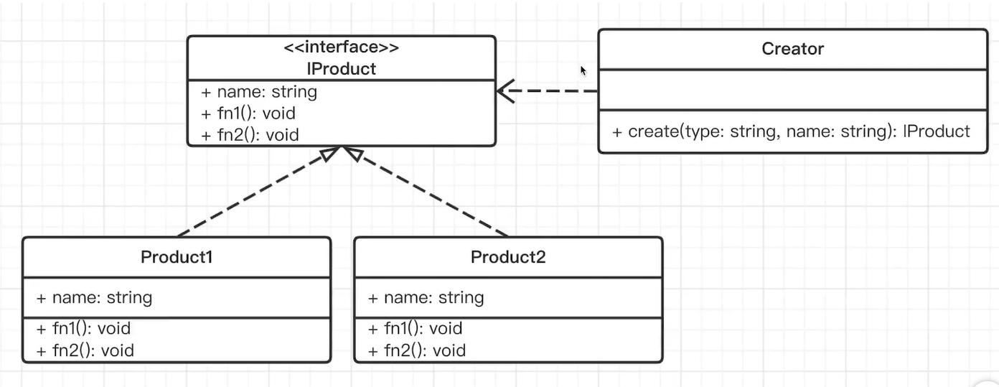

# 工厂模式

所谓的工厂模式，是创建对象的一种方式。不用每次都亲自创建对象，而是通过一个既定的“工厂“（一般指函数或类）来生产对象。

比如：现在你要得到一个汉堡，你是跟服务员要一个，还是自己动手做一个? 这个问题，服务员就是工厂方法，而动手做一个其实就是 `new A()` 。另外从快餐店考虑，你想要提供一个汉堡，是让服务员(工厂方法)做出来(new A())给客户，还是让客户自己做一个汉堡?

伪代码如下：

```ts
class Foo {
  constructor (type: string) { console.log(`动手做${type}汉堡`) }
}
// 每次需要汉堡，就亲力亲为的通过new实例化一个出来
const f1 = new Foo('鸡肉')
const f2 = new Foo('牛肉')
```

而如果改为工厂模式，则如下：

```ts
class Foo {
  constructor (type: string) { console.log(`动手做${type}汉堡`) }
}
function create (type: string) { return new Foo(type); }
// 工厂函数，全部都由这个函数去实例化
const f1 = create('鸡肉')
const f2 = create('牛肉')
```

## 代码

```ts
interface Food {
  name: string;
  say(): void;
  run(): void;
}

class 汉堡 implements Food {
  constructor(public name: string) {}
  say() {
    console.log("汉堡 say");
  }
  run() {
    console.log("汉堡 run");
  }
}

class 薯条 implements Food {
  constructor(public name: string) {}
  say() {
    console.log("薯条 say");
  }
  run() {
    console.log("薯条 run");
  }
}

class Creater {
  // 依赖倒置原则：这里返回值写明是Food，而不是具体的某个类
  create(type: string, name: string): Food {
    if (type === "汉堡") {
      return new 汉堡(name);
    } else if (type === "薯条") {
      return new 薯条(name);
    }
    throw new Error("not found");
  }
}
const c = new Creater();
const p1 = c.create("汉堡", "牛肉");
const p2 = c.create("薯条", "大份");
```

上面代码中，对于`create(type: string, name: string): Food {}` 方法的返回值，特意写成`interface Food`的，这样只要是某个类实现了该接口的，都可以在这类创建。

对应的UML图如下：




## 总结

我们遇到 `new XX()` 的时候，就需要想要这里是否需要改为工厂模式