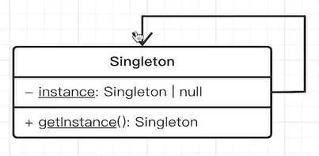

# 单例模式

单例模式：一个 对象/实例 只能被创建一次，创建之后缓存起来，以后继续使用。实现全局唯一的特性


## 在ts中实现单例模式

```ts
// ts中实现单例模式
class Utils {
  // 3. 静态方法中只能访问静态变量，所以这里也需要变成静态变量
  static instance: Utils;
  // 2. 单独提供一个方法给外界调用，因为外界无法通过实例化了，所以该方法需要时静态方法
  static getInstance() {
    if (!this.instance) {
      this.instance = new Utils();
    }
    return this.getInstance;
  }
  // 1.构造函数加上privte，外界就无法通过`new Utils()`创建实例了
  private constructor() {}
}

const u1 = Utils.getInstance();
const u2 = Utils.getInstance();
console.log(u1 === u2);
```

对应的UML图



## 在js中实现单例模式

主要使用到闭包的特性

```js
// @ts-nocheck
function genGenInstance() {
  let instance;
  // 类的实现
  class Singleton {
  }

  return () => {
    if (instance === null) {
      instance = new Singleton();
    }
    return instance;
  }
}

const genInstance = genGenInstance();
const s1 = genGenInstance();
const s2 = genGenInstance();
s1 === s2
```

