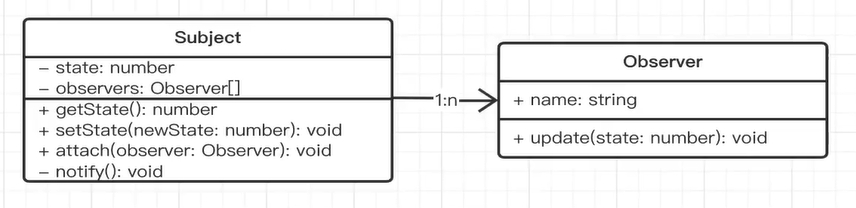

# 观察者模式

现实生活中的观察者模式，比如我们去餐厅吃饭，我们点好餐后，就坐着等，等服务员做好了拿过来。这个过程我们就是观察者


比如我们常写的DOM事件监听也是一种观察者模式

```js
const $btn1 =$('#btn1')$btn1.click(function()console.log(1)
$btn1.click(() => {console.log(2)}
$btn1.click(() => {console.log(3)}
```

上面代码中，我们注册了2个事件，注册之后我们就不用管了，等到什么时候用户触发了，再执行对应的回调函数


以及vue的声明周期函数，也是一种观察者模式，我们不用关心vue组件里面具体怎么实例化的，只要到了节点触发生命周期函数执行对应的方法就好了。


## ts代码演示

```ts
class Subject {
  private status: number = 0;
  private observers: Observer[] = []; // 用数组存观察者，就可以实现1:n
  // 状态改变的时候，就通知所有的观察者执行update方法
  getStatus() {
    return this.status;
  }
  setStatus(newStatus: number) {
    this.status = newStatus;
    if (this.status === 1) {
      this.notify();
    }
  }
  // 添加观察者
  public attach(observer: Observer) {
    this.observers.push(observer);
  }
  // 遍历通知
  private notify() {
    this.observers.forEach((observer) => {
      observer.update(this.status);
    });
  }
}

class Observer {
  constructor(private name: string) {}
  update(status: number) {
    console.log("触发update", status);
  }
}

const sub = new Subject();
const o1 = new Observer("AA");
const o2 = new Observer("BB");
sub.attach(o1);
sub.attach(o2);
sub.setStatus(1);
```

