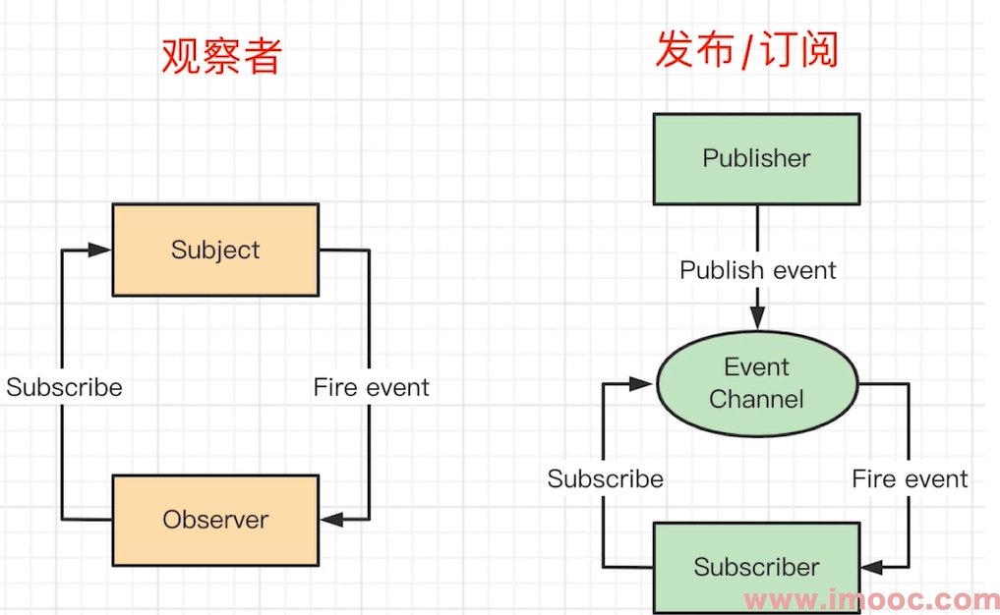

# 发布订阅模式

发布订阅模式容易和观察者模式混淆

## 发布订阅模式和观察者模式的区别

和观察者模式的区别：观察者模式，我们是一个被动的观察者，这件事到底什么时候执行，我们不是说了算。什么时候执行了，只要他执行对应函数了就可以。就像前面说的DOM加点击事件就是一个观察者模式，我们加好事件之后，用户什么时候点击有没有点击，不是我们关心的。

发布订阅模式：我即可以发布，又可以订阅，即我可以观察执行回调，又可以主动触发。是观察者模式的另外一种实现方式。

比如 mitt 这库就是发布订阅模式

从上面可以看出，观察者的 Subject 和 Observer 直接绑定，中间无媒介。而发布订阅模式的，Publisher 和 Observer 互不认识，中间有媒介。

简单的说，可以看下是否有手动触发机制（即emit），有的话就是发布订阅模式。

